# Modelo conceptual del dominio — amiva.pet

**Versión:** 1.0  
**Fecha:** 2026-09-24  
**Fuente:** `docs/02-requerimiento.md` versión 3.17 y `docs/03-casos-uso-mvp.md` versión 1.16 (aprobados)  
**Estado:** aprobado completo (bloques 1 a 9) el 2026-09-24. El modelo de datos físico está en `docs/07-modelo-datos.md`.

## 1. Propósito y alcance

Describe **qué cosas existen en el dominio, cómo se relacionan y qué reglas las gobiernan**, sin decidir todavía tablas, columnas, tipos ni índices. Eso corresponde al modelo físico, que se hará después.

Convenciones del documento:

- Los nombres de entidad van en singular y en español (`Negocio`, `Sucursal`).
- Las relaciones se leen en ambos sentidos: "un negocio tiene una o más sucursales; una sucursal pertenece a un solo negocio".
- Cada entidad indica si es del **núcleo genérico** (reutilizable en otros tipos de negocio) o del **vertical de mascotas**.
- Los diagramas usan Mermaid y solo muestran entidades y relaciones.

## 2. Bloques

| # | Bloque | Casos de uso | Capa | Estado |
|---|---|---|---|---|
| 1 | Identidad y acceso | UC-01 a UC-05, UC-44 | Núcleo | **Aprobado** (2026-09-24) |
| 2 | Suscripciones, planes y parámetros | UC-05, UC-29, UC-34 | Núcleo | **Aprobado** (2026-09-24) |
| 3 | Mascotas, propiedad y espacios | UC-06, UC-11, UC-12, UC-37, UC-39, UC-45, UC-46 | Vertical | **Aprobado** (2026-09-24) |
| 4 | Vinculación, privacidad y consentimientos | UC-07 a UC-10, UC-30, UC-47 a UC-49 | Núcleo + vertical | **Aprobado** (2026-09-24) |
| 5 | Expediente, prevención y documentos | UC-13 a UC-17 | Vertical | **Aprobado** (2026-09-24) |
| 6 | Servicios, agenda y citas | UC-18 a UC-23, UC-49, UC-50 | Núcleo | **Aprobado** (2026-09-24) |
| 7 | Inventario, promociones y ventas | UC-24 a UC-28, UC-43, UC-51 | Núcleo | **Aprobado** (2026-09-24) |
| 8 | Referidos | UC-38, UC-40 a UC-42 | Núcleo | **Aprobado** (2026-09-24) |
| 9 | Notificaciones, reseñas, campañas y auditoría | UC-31 (R2), UC-32, UC-33, UC-52, UC-53 | Núcleo | **Aprobado** (2026-09-24) |

Plan, Suscripción y Entitlement se mencionan en el bloque 1 solo en lo que afecta al acceso; su modelo completo es el bloque 2.

---

## 3. Bloque 1 — Identidad y acceso

### 3.1 Qué resuelve

- Quién es cada persona que entra al sistema y cómo se autentica.
- A qué negocio y a qué sucursales tiene acceso, y con qué permisos.
- Cómo se separan los datos de cada negocio (multi-tenant).
- Cómo se distingue al usuario final, al personal del negocio y al administrador de plataforma.

### 3.2 Separación entre Keycloak y amiva.pet

| Responsabilidad | Dónde vive |
|---|---|
| Autenticación: contraseña, Google, Facebook, Apple, verificación de correo, sesiones y tokens | **Keycloak** |
| Vinculación de cuentas de Google, Facebook y Apple a una misma persona | **Keycloak** |
| Identidad interna de la persona dentro del dominio | **amiva.pet** (`Usuario`, ligado al identificador de Keycloak) |
| Autorización: a qué negocio y sucursal accede y con qué rol y permisos | **amiva.pet** |

**Por qué la autorización no vive en Keycloak:** los permisos de amiva.pet dependen del negocio y de la sucursal (una persona puede ser veterinaria en una sucursal y administradora en otra, o trabajar en dos negocios). Los roles de Keycloak son globales y no modelan bien esa combinación. Keycloak dice **quién eres**; amiva.pet decide **qué puedes hacer y dónde**.

Consecuencia: la entidad `IdentidadExterna` de la sección 18 del requerimiento **no se modela en amiva.pet**. Las cuentas de Google, Facebook y Apple las guarda Keycloak como identidades federadas; amiva.pet solo guarda el identificador de Keycloak del usuario.

### 3.3 Entidades

| Entidad | Capa | Qué es | Reglas principales |
|---|---|---|---|
| **Usuario** | Núcleo | Una persona con cuenta en el sistema. Única en toda la plataforma. | Se liga 1 a 1 con una cuenta de Keycloak. Correo único y verificado. Estados: `pendiente de verificación`, `activo`, `bloqueado`, `eliminado` (lógico). Una misma persona puede ser dueño de mascotas y, además, personal de uno o varios negocios, con la misma cuenta. |
| **PerfilUsuarioFinal** | Vertical | Datos de la persona como dueño o usuario autorizado: nombre visible, teléfono, preferencias de notificación. | Se crea al registrarse en la app móvil (UC-01). Se liga a los espacios de mascotas y al código de invitación. |
| **Negocio** | Núcleo | La empresa cliente de la plataforma, identificada por RFC. **Es el tenant.** | RFC único. Tiene logo y pie de ticket configurable. Lo da de alta solo el administrador de plataforma (UC-03). Toda la información operativa lleva su identificador (`negocioId`) como llave de aislamiento (RLS). Tiene políticas de negocio (UC-44). |
| **Sucursal** | Núcleo | Ubicación física donde opera el negocio. | Pertenece a un solo negocio. Tiene dirección, teléfono, ubicación geográfica (PostGIS), horarios y estado (`activa`, `inactiva`). Es la unidad de inventario, agenda y ventas. |
| **MiembroNegocio** | Núcleo | La relación de un usuario con un negocio como personal. Equivale a `UsuarioTenant` del requerimiento. | Un usuario puede ser miembro de varios negocios. Estados: `activo`, `desactivado`. Lo crea el administrador de negocio (UC-04) o el de plataforma en el alta (UC-03). Desactivarlo corta el acceso a ese negocio sin afectar su cuenta ni sus otros negocios. |
| **AsignacionRol** | Núcleo | Qué rol tiene un miembro y dónde: en todo el negocio o en una sucursal concreta. | Un miembro puede tener varias asignaciones (por ejemplo, Veterinario en la sucursal Centro y Recepción en la sucursal Norte). Una asignación de alcance negocio aplica a todas sus sucursales. |
| **Rol** | Núcleo | Conjunto de permisos con nombre: Administrador de negocio, Recepción, Veterinario, Estilista. | Catálogo definido por la plataforma en el MVP. |
| **Permiso** | Núcleo | Acción concreta que se puede autorizar, por ejemplo `cita.responder`, `venta.cancelar`, `expediente.consultar_clinico`. | La matriz rol-permiso está en `docs/08-matriz-roles-permisos.md`. |
| **Profesional** | Núcleo | Datos profesionales de un miembro que presta servicios: especialidad y cédula profesional si aplica. | Solo para miembros que atienden citas o firman registros clínicos. Se usa en agenda y expediente. |
| **UsuarioPlataforma** | Núcleo | Marca a un usuario como administrador de `admin.amiva.pet`. | Separado por completo de los negocios: no es miembro de ningún negocio por serlo. Todas sus acciones se auditan. |
| **PoliticaNegocio** | Núcleo | Configuración que aplica por igual a todas las sucursales de un negocio. | En el MVP: aceptar productos proporcionados por el dueño (activada por defecto). Cambios auditados. |
| **Auditoria** | Núcleo | Registro de quién hizo qué, cuándo, dónde y sobre qué. | Transversal a todos los bloques. En este bloque: altas, bloqueos, asignaciones de rol, cambios de política, inicios de sesión de plataforma. |

### 3.4 Relaciones

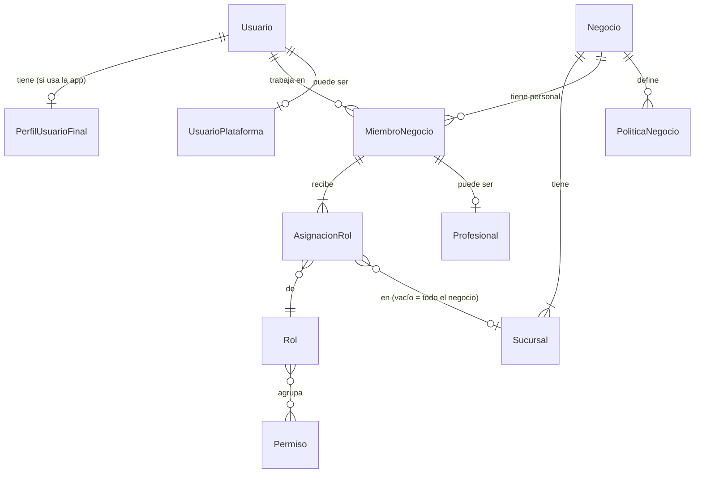

Lectura:

- Un **usuario** puede tener perfil de usuario final, ser miembro de cero o más negocios y, aparte, ser administrador de plataforma.
- Un **negocio** tiene una o más sucursales y cero o más miembros.
- Un **miembro** tiene una o más asignaciones de rol; cada una apunta a un rol y, opcionalmente, a una sucursal.
- Un **rol** agrupa muchos permisos y un permiso puede estar en muchos roles.

### 3.5 Cómo se decide el acceso

Para cada petición, el API:

1. Valida el token de Keycloak y obtiene el `Usuario`.
2. Si el usuario opera como personal, toma el **negocio y la sucursal activos** que eligió en `app.amiva.pet` o la tablet.
3. Verifica que sea `MiembroNegocio` activo de ese negocio.
4. Reúne los permisos de sus asignaciones que aplican a esa sucursal (las de la sucursal más las de alcance negocio).
5. Verifica el permiso que exige la operación.
6. Verifica el estado de la suscripción del negocio (bloque 2): en `solo lectura` rechaza escrituras; en `sin acceso` rechaza todo.
7. Fija el negocio en la sesión de base de datos para que RLS filtre los datos.

Para el usuario final, el acceso a una mascota o a un registro depende de la propiedad y la vinculación (bloques 3 y 4), no de roles.

### 3.6 Selección de negocio y sucursal

Una persona que trabaja en más de un negocio, o en varias sucursales, elige al entrar en cuál va a operar. El cambio de negocio o sucursal no requiere cerrar sesión. La sucursal activa determina agenda, inventario y POS.

### 3.7 Ciclos de vida

**Usuario:**

```
pendiente de verificación ──verifica correo──▶ activo ◀──desbloquea── bloqueado
                                                 │  ──bloquea──────────▶
                                                 └──solicita eliminación──▶ eliminado (lógico)
```

**MiembroNegocio:** `activo` ⇄ `desactivado`. No se elimina, para conservar la trazabilidad de lo que registró.

### 3.8 Configuración de Keycloak

| Elemento | Propuesta |
|---|---|
| Realm | `amiva`, uno solo para todas las personas. |
| Clientes | `app-usuario` (app móvil), `app-negocio` (Flutter web y tablet), `admin` (portal de plataforma), `api` (validación de tokens). |
| Proveedores de identidad | Google, Facebook y Apple, habilitados solo para `app-usuario`. |
| Usuario y contraseña | Para `app-negocio` y `admin`. |
| Segundo factor | Obligatorio para `admin`; opcional para administradores de negocio en el MVP. |
| Roles en Keycloak | Ninguno de negocio. Solo se usa para autenticar. |

### 3.9 Decisiones confirmadas

| # | Decisión |
|---|---|
| 1 | Una sola cuenta por persona: la misma cuenta sirve para la app del dueño y para `app.amiva.pet`. |
| 2 | El negocio es el tenant; no hay entidad `Tenant` aparte. |
| 3 | Roles fijos en el MVP (Administrador de negocio, Recepción, Veterinario, Estilista); roles propios del negocio en una versión posterior. |
| 4 | Un rol puede asignarse a una sucursal concreta o a todo el negocio. |
| 5 | El administrador de plataforma no es miembro de ningún negocio ni ve datos operativos, salvo las funciones de soporte que se definan. |
| 6 | Segundo factor obligatorio para administradores de plataforma; opcional para administradores de negocio en el MVP. |
| 7 | Un solo realm de Keycloak (`amiva`) para todos, con segundo factor en el cliente `admin`. |

---

## 4. Bloque 2 — Suscripciones, planes y parámetros

### 4.1 Qué resuelve

- Qué plan tiene cada negocio, qué incluye y cuánto cuesta.
- En qué estado está su suscripción y qué puede hacer en cada estado (operar, solo leer, nada).
- Qué se le cobra cada periodo, qué pagó y qué meses tiene a favor por referidos.
- Dónde viven los valores configurables de la plataforma y cómo cambian sin afectar el pasado.

En el MVP **el cobro es manual**: la plataforma genera los cargos, el negocio paga por fuera y el administrador de plataforma registra el pago.

### 4.2 Entidades

| Entidad | Capa | Qué es | Reglas principales |
|---|---|---|---|
| **Plan** | Núcleo | Oferta comercial: Básico, Extendido, Tienda Digital. | Estados: `disponible`, `oculto` (existe pero no se ofrece; Tienda Digital hasta que exista el módulo), `retirado` (ya no se vende; quien lo tiene lo conserva). |
| **PrecioPlan** | Núcleo | Precio mensual del plan y precio de cada sucursal adicional, con vigencia. | Un cambio de precio crea un precio nuevo con fecha de inicio; no modifica cargos ya generados. |
| **Entitlement** | Núcleo | Algo que el plan habilita o limita. En el MVP: sucursales incluidas, si admite sucursales adicionales y número de campañas activas. | Se define por plan. El API lo consulta para permitir o negar una función. Es la única forma de diferenciar planes; no se escriben reglas "si el plan es X" en el código. |
| **Suscripcion** | Núcleo | El contrato vigente de un negocio con la plataforma. | Una por negocio. Guarda plan actual, estado y fechas del periodo actual. La prueba se usa una sola vez por RFC. |
| **CambioSuscripcion** | Núcleo | Historial de la suscripción: cambios de plan y de estado. | Cada cambio guarda estado o plan anterior y nuevo, fecha, motivo y quién lo hizo (usuario o proceso). |
| **PeriodoFacturacion** | Núcleo | Un mes de servicio de un negocio. | Estados: `abierto`, `por pagar`, `pagado`, `bonificado` (cubierto con un mes a favor). Dos periodos pagados consecutivos es la condición del referido de negocio (bloque 8). |
| **Cargo** | Núcleo | Cada concepto que se cobra en un periodo. | Tipos: `plan`, `sucursal adicional`, `espacio pagado de mascota`. Guarda importe con dos decimales y el precio vigente al generarse. |
| **PagoSuscripcion** | Núcleo | Pago registrado manualmente por el administrador de plataforma. | Fecha, importe, medio, referencia y quién lo registró. Un pago puede cubrir uno o varios periodos. |
| **MovimientoMesAFavor** | Núcleo | Libro de meses gratuitos del negocio: ganados por referidos y consumidos en periodos. | Igual que el inventario: el saldo es la suma de los movimientos y no se edita. Los meses no caducan. |
| **CargoEspacioMascota** | Vertical | Registro de un espacio pagado vendido por una sucursal (UC-37). | Guarda sucursal, usuario final, fecha e importe vigente. Se incorpora como cargo al periodo del negocio. |
| **Parametro** | Núcleo | Valor configurable de la plataforma, identificado por una clave. | Tiene tipo (número, días, horas, importe, sí/no, lista). Lo cambia solo el administrador de plataforma. |
| **VersionParametro** | Núcleo | Cada valor que ha tenido un parámetro. | Guarda valor, vigente desde, quién lo cambió y motivo. Los procesos usan el valor vigente en el momento en que ocurre el hecho. |

Las políticas por negocio (`PoliticaNegocio`, bloque 1) no son parámetros de plataforma: las decide cada negocio.

### 4.3 Relaciones

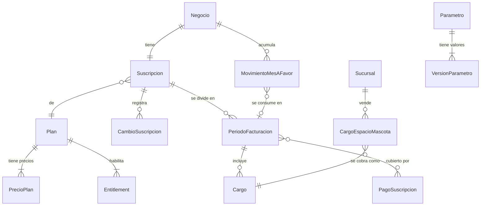

### 4.4 Ciclo de vida de la suscripción

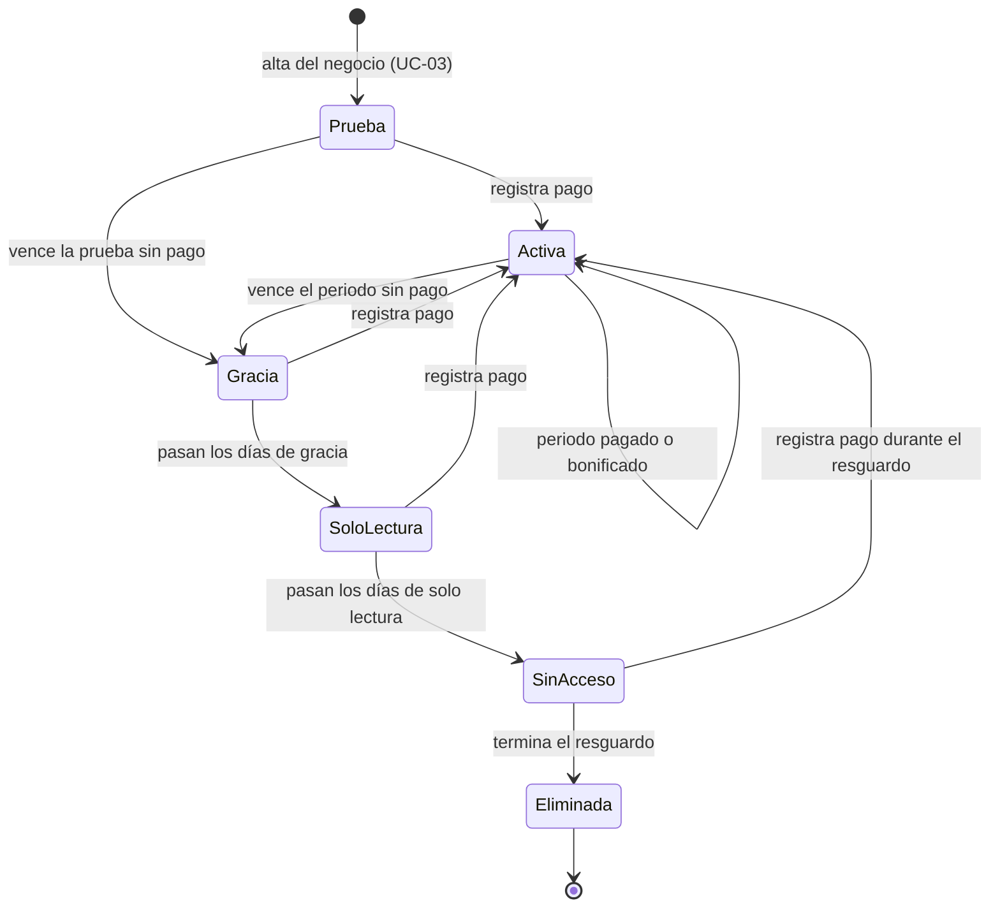

| Estado | Qué puede hacer el negocio | Plazo (parámetro) |
|---|---|---|
| Prueba | Todo lo que incluye el plan | 10 días naturales |
| Activa | Todo lo que incluye el plan | Mientras pague |
| Gracia | Todo, con aviso de pago pendiente | 2 días |
| Solo lectura | Consultar; no registrar ni modificar | 5 días |
| Sin acceso | Nada; los datos se resguardan | 6 meses |
| Eliminada | Nada; se aplica la eliminación de la sección 7 del requerimiento (UC-36) | — |

Durante `sin acceso` los dueños de mascotas conservan su propia información (carnet, línea de tiempo); lo que se bloquea es la operación del negocio.

### 4.5 Cierre de periodo (UC-34)

Al vencer un periodo, el proceso nocturno:

1. Calcula los cargos: plan, sucursales adicionales y espacios pagados de mascotas vendidos en el periodo.
2. Si el negocio tiene meses a favor, consume uno y bonifica el cargo del plan.
3. Si queda algo por cobrar, deja el periodo `por pagar`; si no, lo deja `bonificado`.
4. Abre el siguiente periodo.
5. Si un periodo `por pagar` no se paga, la suscripción avanza por gracia, solo lectura y sin acceso.

### 4.6 Catálogo inicial de parámetros

| Grupo | Parámetro | Valor inicial |
|---|---|---|
| Suscripción | Días de prueba | 10 |
| Suscripción | Días de gracia | 2 |
| Suscripción | Días de solo lectura | 5 |
| Suscripción | Meses de resguardo | 6 |
| Mascotas | Espacios base por usuario | 2 |
| Mascotas | Máximo de espacios por beneficio | 5 |
| Mascotas | Máximo de espacios pagados | Sin tope |
| Mascotas | Cargo por espacio pagado | Por definir |
| Mascotas | Días para ocultar una mascota fallecida | 30 |
| Mascotas | Años sin actividad para eliminar una mascota | 5 |
| Mascotas | Días de vigencia de una solicitud de transferencia o autorización | 7 |
| Mascotas | Días de vigencia de una invitación de activación | 30 |
| Referidos | Servicios pagados para el beneficio de usuario | 10 |
| Referidos | Meses consecutivos pagados del negocio referido | 2 |
| Agenda | Minutos antes para cancelar o reprogramar (mínimo; el servicio puede exigir más) | 30 |
| Agenda | Días máximos de anticipación para solicitar una cita | 30 |
| Agenda | Tolerancia para marcar no atendida | Por definir |
| Notificaciones | Días antes del recordatorio de vacuna | 7 |
| Notificaciones | Horas antes del recordatorio de cita | 2 |
| Campañas | Máximo de campañas por dueño por semana (correo o push) | 2 |
| Ventas | Tasa de IVA por defecto | 16 % |
| Archivos | Tamaño máximo por tipo de documento | Sección 7 del requerimiento |
| Reseñas | Retención | Por definir |

### 4.7 Entitlements iniciales

| Entitlement | Básico | Extendido |
|---|---|---|
| Sucursales incluidas | 1 | Configurable |
| Admite sucursales adicionales con precio | No | Sí |
| Campañas activas al mismo tiempo | 1 | Configurable |

Todos los valores se configuran por plan desde `admin.amiva.pet`. Si un negocio Básico necesita otra sucursal, cambia a Extendido. El límite de campañas cuenta solo las activas: el negocio puede tener otras configuradas como borrador o inactivas.

### 4.8 Decisiones confirmadas

| # | Decisión |
|---|---|
| 1 | Básico: una sucursal y una campaña. Extendido: para varias sucursales. Sucursales y campañas son configurables por plan. |
| 2 | Periodos mensuales en el MVP. |
| 3 | El mes a favor bonifica solo el cargo del plan. |
| 4 | Una prueba vencida sin pago sigue el camino del impago. |
| 5 | Sucursales adicionales: se cobra el mayor número de sucursales activas en el periodo, sin prorrateo. |
| 6 | Los precios de plan incluyen IVA. |
| 7 | Se retira el "límite de mascotas por negocio" del requerimiento. |
| 8 | Todos los parámetros los fija la plataforma; los negocios solo deciden sus políticas. |

Los parámetros marcados "por definir" se configuran más adelante desde `admin.amiva.pet`; no bloquean el modelo.

---

## 5. Bloque 3 — Mascotas, propiedad y espacios

### 5.1 Qué resuelve

- Qué es una mascota y qué datos la describen.
- Quién es su propietario principal y quién más puede actuar por ella.
- Cómo cambia de propietario sin perder su historia.
- Cuántas mascotas puede tener cada usuario (espacios base, por beneficio y pagados) y cómo se liberan.
- Qué pasa cuando una mascota fallece.

La mascota **pertenece al dueño, no al negocio**: existe una sola vez en toda la plataforma y la ven los negocios con los que el dueño se vincula (bloque 4). Lo que cada negocio registra de ella es del negocio (bloque 5). La única excepción es la **mascota provisional**, que un negocio registra para un cliente sin app y que solo existe dentro de ese negocio hasta que el dueño la activa (bloque 4, sección 6.6).

### 5.2 Entidades

| Entidad | Capa | Qué es | Reglas principales |
|---|---|---|---|
| **Mascota** | Vertical | El animal. Entidad central de la plataforma. | Datos de la sección 5 del requerimiento: nombre, fotografía, especie, raza, sexo, estado reproductivo, fecha de nacimiento (la edad se calcula), color, características físicas, señas particulares, microchip, alergias, condiciones especiales, medicamentos activos, dieta y veterinario habitual. Estados en 5.5. Si es provisional, guarda el negocio que la registró. Guarda el tipo de espacio que ocupa con su propietario actual. |
| **Especie** | Vertical | Catálogo: perro, gato, ave, roedor, reptil, otro. | Lo administra la plataforma. |
| **Raza** | Vertical | Catálogo de razas por especie. | Lo administra la plataforma. Siempre existe la opción "Otra" o "Mestizo" con texto libre. |
| **Propiedad** | Vertical | Quién es el propietario principal de una mascota y desde cuándo. | Siempre hay exactamente un propietario vigente. Al transferir, la propiedad anterior se cierra con fecha y se abre una nueva; nunca se borra. |
| **Autorizacion** | Vertical | Permiso que el propietario da a otro usuario (familiar o cuidador) sobre una mascota. | El autorizado tiene cuenta propia. Lo que puede hacer se define en 5.4. Estados: `pendiente`, `vigente`, `rechazada`, `cancelada`, `vencida`, `retirada` (por el propietario o por renuncia). Una mascota puede tener cero o más autorizados. Se retiran todas al transferir la mascota. |
| **TransferenciaPropiedad** | Vertical | Solicitud para pasar una mascota a otro usuario (UC-11). | Estados: `solicitada`, `aceptada`, `rechazada`, `cancelada`, `vencida` (7 días sin respuesta, parámetro). La inicia el propietario; la acepta el nuevo propietario solo si tiene un espacio libre. Al aceptarse se cierran la propiedad y las autorizaciones anteriores. |
| **Fallecimiento** | Vertical | Registro de la muerte de una mascota (UC-12). | Lo registra el propietario desde la app o el personal de un negocio vinculado. Guarda fecha, quién lo registró y, si fue un negocio, cuál. Libera el espacio de inmediato. A los 30 días (parámetro) la mascota se oculta para el dueño. |
| **Espacios del usuario** | Vertical | Cuántas mascotas puede tener un usuario, por tipo. | Ver 5.3. No es una lista de registros: se calcula. |

### 5.3 Cómo se calculan los espacios

En lugar de guardar un registro por cada espacio, la capacidad se **calcula** a partir de hechos que ya existen:

| Tipo | Capacidad | Viene de |
|---|---|---|
| Base | Valor vigente del parámetro "espacios base" (2) | Bloque 2 |
| Por beneficio | Número de beneficios de referido otorgados al usuario, hasta el máximo (5) | Bloque 8 |
| Pagado | Número de espacios pagados vendidos al usuario (`CargoEspacioMascota`) | Bloque 2 |

- **Ocupados** de un tipo = mascotas **activas** del usuario que ocupan ese tipo.
- **Libres** = capacidad − ocupados.
- Una mascota fallecida o transferida deja de ser activa para ese usuario, así que su espacio se libera **sin ningún paso adicional**.
- Al registrar o recibir una mascota se asigna el primer tipo con espacio libre: base, beneficio, pagado.

Ventajas: no hay registros de espacios que se desincronicen, y si la plataforma sube el parámetro de espacios base, todos los usuarios ganan la diferencia de inmediato. Si lo baja, nadie pierde mascotas ya registradas; solo no podrá agregar más hasta tener espacio libre.

La entidad `EspacioMascota` de la sección 18 del requerimiento queda como este cálculo, no como tabla.

### 5.4 Qué puede hacer cada persona con una mascota

| Acción | Propietario | Autorizado |
|---|---|---|
| Ver ficha, carnet y línea de tiempo | Sí | Sí |
| Llevar y recoger en la sucursal | Sí | Sí |
| Solicitar, cancelar y reprogramar citas | Sí | Sí |
| Editar datos de la mascota | Sí | No |
| Vincular o desvincular negocios | Sí | No |
| Dar o retirar autorizaciones | Sí | No |
| Transferir la propiedad | Sí | No |
| Exportar la línea de tiempo | Sí | No |

### 5.5 Ciclo de vida de la mascota

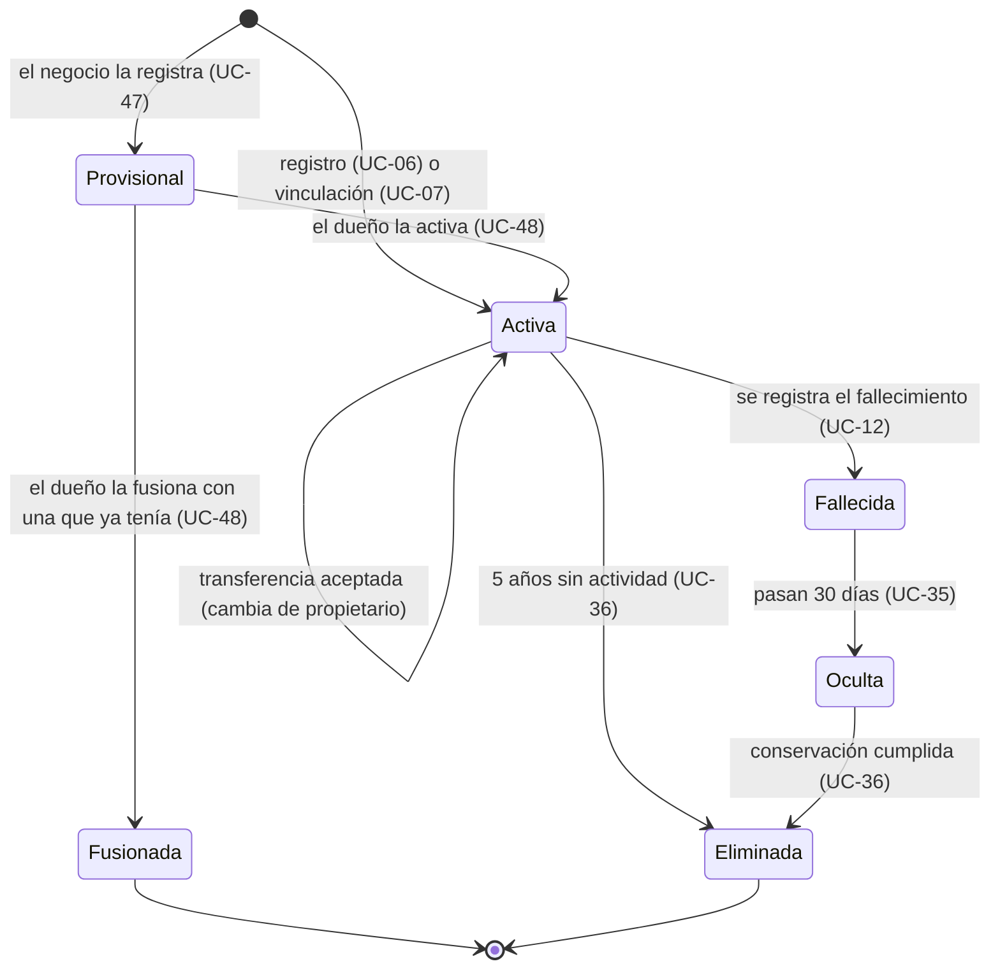

- **Provisional:** solo la ve el negocio que la registró; no tiene propietario ni ocupa espacios.
- **Fusionada:** su historial pasó a otra mascota; se conserva solo como referencia.
- **Fallecida:** el dueño y los negocios vinculados todavía la ven; ya no se agendan citas ni se transfiere.
- **Oculta:** el dueño ya no la ve; los negocios que tenían acceso la siguen viendo en solo lectura; la información se conserva conforme a las reglas de conservación.
- **Eliminada:** se aplican las reglas de eliminación de la sección 7 del requerimiento.

### 5.6 Relaciones

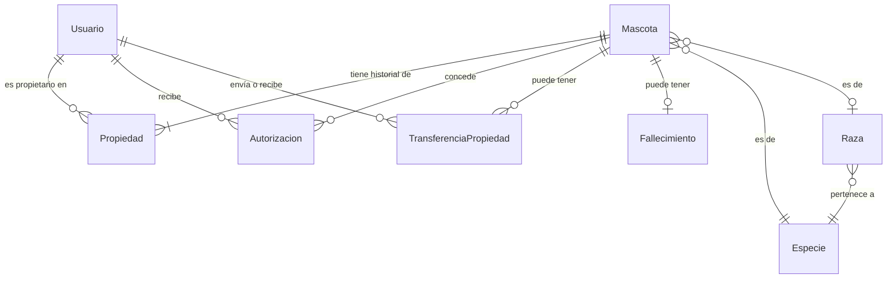

### 5.7 Autorizaciones y buzón

El requerimiento definía al usuario autorizado, pero ningún caso de uso decía cómo se autoriza. Se agregan:

- **UC-45 — Autorizar usuario sobre una mascota:** el propietario invita por enlace, QR o correo de una cuenta existente; la persona acepta desde su buzón; cualquiera de los dos puede terminar la autorización. La mascota autorizada no ocupa espacio del autorizado.
- **UC-46 — Consultar buzón:** sección de la app con dos apartados.

| Apartado | Contenido | Acciones |
|---|---|---|
| Solicitudes recibidas | Transferencias y autorizaciones que esperan respuesta | Aceptar o rechazar |
| Solicitudes enviadas | Transferencias y autorizaciones que el usuario envió, con su estado | Cancelar mientras estén pendientes |
| Avisos | Notificaciones internas informativas (bloque 9) | Marcar como leído |

El buzón **no es una entidad nueva**: muestra las `TransferenciaPropiedad` y `Autorizacion` pendientes del usuario, y sus `Notificacion` internas. Así, cualquier tipo de solicitud que se agregue después aparece ahí sin rediseñar la pantalla.

### 5.8 Decisiones confirmadas

| # | Decisión |
|---|---|
| 1 | Los espacios se calculan a partir de parámetros, beneficios y espacios pagados; no se guardan como registros. |
| 2 | El autorizado ve la ficha, lleva y recoge y gestiona citas; no edita, no vincula, no autoriza, no transfiere y no exporta. |
| 3 | Se agrega UC-45 para autorizar usuarios, más el buzón (UC-46) para solicitudes y avisos. |
| 4 | El fallecimiento lo registra el propietario o el personal de un negocio vinculado. |
| 5 | El microchip no se repite entre mascotas activas. |
| 6 | Las solicitudes de transferencia y autorización vencen a los 7 días (parámetro) y se pueden cancelar antes. |
| 7 | La ficha muestra el último peso; el historial vive en el expediente. |
| 8 | El veterinario habitual se elige entre negocios vinculados o se captura como texto libre. |

---

## 6. Bloque 4 — Vinculación, privacidad y consentimientos

### 6.1 Qué resuelve

- Cómo un negocio obtiene acceso a un dueño y a sus mascotas, y cómo lo pierde.
- Qué información ve cada negocio de una mascota, según quién la generó.
- Qué aceptó cada persona, en qué versión del texto y cuándo.

Es el bloque que protege la regla central del producto: **la mascota es del dueño, el expediente que genera un negocio es de ese negocio, y ningún negocio ve lo clínico de otro.**

### 6.2 Entidades

| Entidad | Capa | Qué es | Reglas principales |
|---|---|---|---|
| **Vinculacion** | Núcleo | La relación aceptada entre un dueño y un negocio. | Se inicia desde una sucursal (queda como sucursal de origen), pero aplica a **todo el negocio**. Estados: `vigente`, `retirada`. La crea el dueño al aceptar el consentimiento (UC-08) y la termina el dueño (UC-09). Hay a lo más una vigente por dueño y negocio. |
| **MascotaVinculada** | Vertical | Qué mascotas del dueño comparte con ese negocio. | El dueño elige cuáles al vincularse y puede agregar o quitar después. Un negocio solo ve las mascotas compartidas. |
| **Cliente** | Núcleo | Cómo ve el negocio a una persona que atiende: datos de contacto, notas internas, etiquetas y preferencias. | Pertenece al negocio (tenant). Estados: `provisional` (sin cuenta en la app) y `vinculado` (ligado a un `Usuario` con vinculación). Las notas internas nunca las ve el dueño. Se conserva aunque la vinculación se retire, pero el negocio deja de navegarlo. |
| **InvitacionActivacion** | Núcleo | Invitación que el negocio envía a un cliente provisional para que active sus mascotas en la app. | Código único, correo destino, mascotas incluidas. Estados: `enviada`, `aceptada`, `vencida` (30 días, parámetro), `cancelada`. Se puede reenviar. Se abre por correo o por QR en la sucursal. |
| **DocumentoLegal** | Núcleo | Cada tipo de texto legal: aviso de privacidad, términos, consentimiento de vinculación, responsiva, etc. | Lo administra la plataforma (UC-30). |
| **VersionDocumentoLegal** | Núcleo | Cada versión publicada de un documento legal. | Texto completo, número de versión y fecha de publicación. No se edita una versión publicada; se publica otra. |
| **Aceptacion** | Núcleo | Constancia de que una persona aceptó una versión concreta. | Guarda usuario, versión aceptada, fecha, contexto (registro, vinculación) y, si aplica, negocio y sucursal. Nunca se borra. |

### 6.3 Niveles de visibilidad

Todo registro sobre una mascota lleva **qué negocio lo generó** y **su nivel**. Con eso se decide quién lo ve:

| Nivel | Qué incluye | Dueño y autorizados | Negocio que lo generó | Otro negocio vinculado |
|---|---|---|---|---|
| 1 — Perfil | Datos generales de la mascota y los que el dueño decida compartir | Sí | Sí | Sí |
| 2 — Prevención | Vacunas, desparasitación, tratamientos preventivos y certificados | Sí | Sí | **Sí** |
| 3 — Clínico | Consultas, diagnósticos, tratamientos, recetas, estudios, procedimientos, cirugías, signos vitales | Sí | Sí | **No** |
| Interno | Notas internas, costos, márgenes y observaciones comerciales | **No** | Sí | No |

Reglas:

- El dueño ve en la línea de tiempo el nombre del negocio que generó cada evento.
- Un negocio sin vinculación vigente no ve nada, ni siquiera lo que él mismo generó, mientras la vinculación esté retirada.
- El nivel lo fija el sistema según el tipo de registro, no quien lo captura.

### 6.4 Ciclo de la vinculación

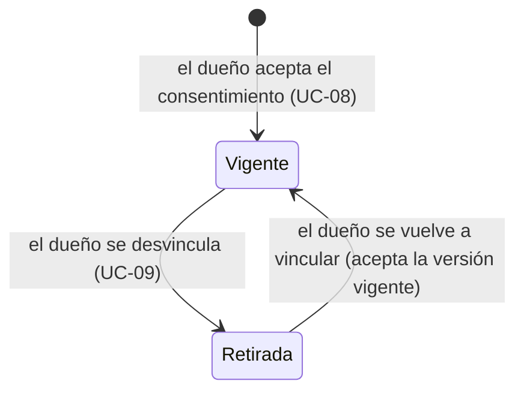

- **Retirada:** el negocio conserva sus registros (obligaciones de conservación), pero no los puede navegar ni ver datos nuevos del dueño.
- **Nueva vinculación:** el negocio recupera el acceso, incluidos los registros que él generó antes.
- **Transferencia de una mascota:** deja de estar compartida con los negocios del propietario anterior. Los negocios conservan lo que registraron, pero solo recuperan el acceso si el nuevo propietario se vincula con ellos.

### 6.5 Relaciones

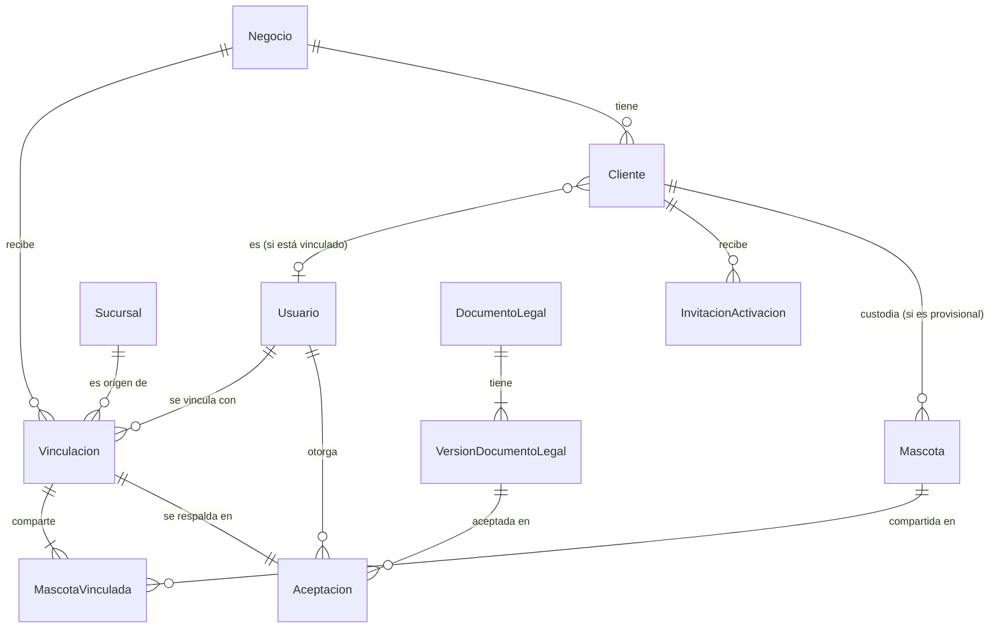

### 6.6 Clientes y mascotas provisionales

Para que un negocio pueda atender a clientes que todavía no usan la app (UC-47 a UC-49):

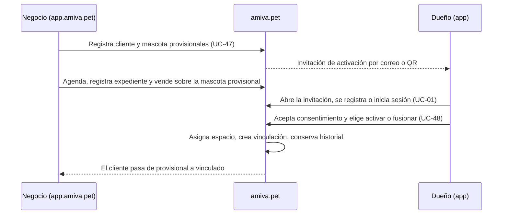

| Aspecto | Mientras es provisional | Después de activarse |
|---|---|---|
| Quién la ve | Solo el negocio que la registró | El dueño y los negocios con los que la comparta |
| Propietario | Ninguno; la custodia el cliente provisional del negocio | El dueño |
| Espacios | No ocupa | Ocupa uno del dueño |
| Nivel 2 para otros negocios | No | Sí |
| Avisos al cliente | Solo correo | Buzón, push y correo |
| Campañas | No | Sí, si cumple la audiencia |
| Servicios para referidos | No cuentan | Cuentan desde la activación de la cuenta |

**Fusión:** si el dueño ya tenía la mascota registrada, el historial del negocio (citas, expediente, vacunas, documentos y ventas) pasa a la mascota existente y la provisional queda como `fusionada`. El microchip ayuda a detectarlo: si coincide, la app sugiere la fusión.

**Varios negocios:** cada negocio tiene su propio cliente provisional de la misma persona. Cada invitación que el dueño acepta suma una vinculación a la misma cuenta.

### 6.7 Decisiones confirmadas

| # | Decisión |
|---|---|
| 1 | La vinculación es con el negocio; todas sus sucursales atienden al dueño. |
| 2 | El dueño elige qué mascotas comparte con cada negocio; por defecto, la mascota con la que llega. |
| 3 | Alergias, condiciones especiales y medicamentos activos se comparten siempre en el nivel 1. |
| 4 | Con la vinculación retirada, el negocio no ve ni lo que él generó; lo recupera si el dueño se vuelve a vincular. |
| 5 | Al transferirse, la mascota deja de estar compartida con los negocios del propietario anterior. |
| 6 | Opción B: el negocio puede registrar clientes y mascotas provisionales, que el dueño activa después desde la app. |
| 7 | Una nueva versión de un texto legal no invalida las aceptaciones anteriores; si es obligatoria, se pide aceptarla al volver a entrar. |

### 6.8 Decisiones derivadas confirmadas

Surgieron al diseñar la opción B y están aplicadas en el requerimiento y los casos de uso:

1. **Correo del cliente provisional:** si no lo tiene, igual se registra y la invitación se muestra como QR en la sucursal.
2. **Activar requiere espacio libre**, igual que recibir una transferencia.
3. **Fusión:** si el dueño ya tenía la mascota, elige fusionarla y el historial del negocio pasa a la existente.
4. **La invitación vence a los 30 días** (parámetro) y se puede reenviar; la mascota provisional se conserva aunque nunca se active.
5. **Clientes provisionales:** reciben recordatorios solo por correo y no reciben campañas.
6. **Citas desde el negocio (UC-49):** el negocio puede agendar citas para cualquier cliente, vinculado o provisional, y nacen confirmadas. Es necesario para clientes sin app y útil para citas por teléfono.
7. **Referidos:** los servicios anteriores a la activación no cuentan.

---

## 7. Bloque 5 — Expediente, prevención y documentos

### 7.1 Qué resuelve

- Qué registra cada negocio sobre una mascota: consultas, signos vitales, recetas, estudios, procedimientos, cirugías, vacunas, desparasitaciones, servicios de estética y documentos.
- Cómo se arma la línea de tiempo y el carnet que ve el dueño.
- Cómo se corrige un registro sin perder lo que decía antes.
- Dónde viven los archivos y quién los puede ver.

Todo lo de este bloque **pertenece al negocio que lo generó** (lleva su `negocioId`) y se muestra según los niveles del bloque 4. Aplica igual a mascotas activas y provisionales.

### 7.2 Idea central: todo es un evento

Cada cosa que le pasa a una mascota es un **evento** con fecha, mascota, quién lo generó (negocio y sucursal, o el dueño), profesional, nivel de visibilidad y, si aplica, la cita que lo originó. Cada tipo de evento agrega su propio detalle.

Así la línea de tiempo es simplemente la lista de eventos visibles para quien la consulta, ordenada por fecha, y agregar un tipo de evento nuevo no cambia la línea de tiempo.

### 7.3 Entidades

| Entidad | Capa | Qué es | Nivel | Reglas principales |
|---|---|---|---|---|
| **EventoMascota** | Vertical | Base común de todo lo que se registra. | El de su tipo | Fecha, mascota, origen (negocio y sucursal, o dueño), profesional, cita de origen y estado (`vigente`, `corregido`). |
| **Consulta** | Vertical | Atención clínica: motivo, diagnóstico, tratamiento y observaciones. | 3 | La registra un veterinario (UC-14). Puede incluir signos vitales, recetas, estudios, procedimientos y aplicaciones. |
| **SignosVitales** | Vertical | Peso, temperatura, frecuencia cardiaca y respiratoria, condición corporal. | 3; el peso, 1 | Normalmente dentro de una consulta. |
| **Receta** | Vertical | Medicamentos indicados, con dosis, frecuencia y duración. | 3 | El dueño la ve y la descarga en PDF; el negocio puede imprimirla. |
| **Estudio** | Vertical | Estudio de laboratorio o de imagen: qué se pidió y su resultado. | 3 | En el MVP el resultado se adjunta como documento; la integración con laboratorios es R6. |
| **Procedimiento** | Vertical | Procedimiento o cirugía: tipo, descripción y observaciones. | 3 | |
| **AplicacionPreventiva** | Vertical | Vacuna, desparasitación o tratamiento preventivo aplicado. | 2 | Producto del inventario o del dueño (sección 7.1 del requerimiento), lote, caducidad, fecha de aplicación y fecha de la próxima dosis. Genera el recordatorio (UC-33). |
| **Certificado** | Vertical | Certificado de vacunación, de salud o de viaje emitido por el negocio. | 2 | Se adjunta como documento firmado. |
| **ServicioNoClinico** | Vertical | Baño, estética u otro servicio sin carácter clínico. | Como 3 | Inicio, conclusión y observaciones (UC-16). Lo ven el dueño y el negocio que lo hizo. |
| **NotaInterna** | Vertical | Observación privada del personal sobre la mascota o el cliente. | Interno | Nunca la ve el dueño ni otro negocio. |
| **EventoDelDueno** | Vertical | Lo que registra el propio dueño: peso en casa, fallecimiento, notas personales. | 1 | No pertenece a ningún negocio. |
| **Documento** | Núcleo | Archivo en Object Storage referenciado desde el dominio. | El del registro al que se liga | Tipo (fotografía, receta, estudio, documento firmado, responsiva, exportación), tamaño, formato y quién lo subió. Eliminación lógica, solo por quien lo subió. Reemplazarlo crea una versión nueva. |

### 7.4 Relaciones

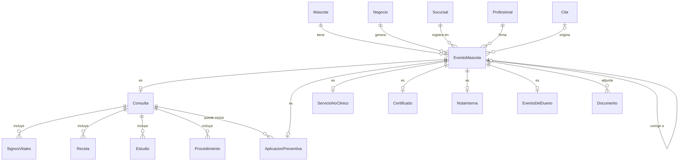

### 7.5 Correcciones

Un registro clínico **no se edita ni se borra**. Si tiene un error:

1. El profesional crea un registro de corrección que apunta al original y explica el motivo.
2. El original queda en estado `corregido`.
3. El dueño y los demás negocios ven solo la versión vigente.
4. El negocio que lo generó y la auditoría ven ambas versiones.

### 7.6 Vistas que se arman a partir de los eventos

| Vista | Qué muestra | Quién la ve |
|---|---|---|
| **Línea de tiempo** | Todos los eventos visibles para quien consulta, por fecha, con el negocio que generó cada uno | Dueño, autorizados y negocios vinculados, cada quien según su nivel |
| **Carnet** | Solo aplicaciones preventivas (nivel 2) con próximas dosis | Dueño, autorizados y negocios vinculados |
| **Expediente del negocio** | Todo lo que generó ese negocio, más el nivel 1 y 2 de los demás | Personal del negocio según su rol |
| **Exportación** | La línea de tiempo del dueño en PDF | Solo el propietario; se genera al pedirla y no se guarda |

### 7.7 Decisiones confirmadas

| # | Decisión |
|---|---|
| 1 | Todo es un evento con una base común y un detalle por tipo. |
| 2 | El peso se comparte en el nivel 1; los demás signos vitales son nivel 3. |
| 3 | Los servicios de estética los ven solo el dueño y el negocio que los hizo. |
| 4 | Los documentos que sube el dueño los ven los negocios con los que comparte la mascota. |
| 5 | Los registros clínicos no se editan ni se borran; se corrigen con un registro nuevo. |
| 6 | Tras una transferencia, el nuevo propietario ve toda la historia de la mascota, sin datos del propietario anterior. |
| 7 | La receta se descarga en PDF desde la app y el negocio puede imprimirla. |
| 8 | El veterinario captura la próxima dosis y el recordatorio sale 7 días antes. |
| 9 | La exportación de la línea de tiempo es en PDF, se genera al pedirla y no se guarda. |

---

## 8. Bloque 6 — Servicios, agenda y citas

### 8.1 Qué resuelve

- Qué servicios ofrece cada negocio, a qué precio y cuánto duran, con variaciones por sucursal y por tipo de mascota.
- Cuándo atiende cada sucursal y cuántas mascotas puede atender a la vez.
- Cómo se pide, se agenda, se atiende y se cancela una cita.
- Cómo encuentra el dueño sucursales y servicios en el mapa.

### 8.2 Entidades

| Entidad | Capa | Qué es | Reglas principales |
|---|---|---|---|
| **Servicio** | Núcleo | Servicio del catálogo del negocio: consulta, vacuna, baño, corte, cirugía, etc. | Nombre, descripción, categoría (clínico, preventivo, estética, otro), duración y precio base, tasa de IVA, tiempo adicional (preparación o limpieza), estado publicado, si el precio se muestra o es "no listado" y, opcionalmente, una ventana de cancelación mayor a la de la plataforma. Pertenece al negocio. |
| **VarianteServicio** | Núcleo | Combinación que cambia precio y duración: especie, tamaño, raza, peso, condición clínica. | Un servicio puede no tener variantes o tener varias. Incluye "Aplicación con producto del dueño" (bloque 5). |
| **ServicioSucursal** | Núcleo | Si una sucursal ofrece un servicio y, si aplica, su precio y duración propios. | Sin ajuste, la sucursal usa los valores del negocio. Equivale a `PrecioSucursal` del requerimiento. |
| **HorarioSucursal** | Núcleo | Días y horas de atención de la sucursal. | Horario semanal más días especiales (cerrado o con horario distinto). |
| **ReglaCapacidad** | Núcleo | Cuántas mascotas puede atender la sucursal al mismo tiempo, por día, franja horaria y categoría de servicio. | Ver 8.6. |
| **Cita** | Núcleo | Atención programada para **una** mascota en una sucursal. | Cliente, mascota, sucursal, servicios, fecha y hora, duración calculada, origen (app del dueño o negocio), quién la solicitó (propietario o autorizado), precio estimado, profesional asignado (opcional) y estado. |
| **ServicioCita** | Núcleo | Cada servicio incluido en la cita, con la variante aplicada. | Guarda el precio y la duración vigentes al agendar. |
| **CambioCita** | Núcleo | Historial de estados y reprogramaciones de la cita. | Estado o fecha anterior y nueva, quién, cuándo y mensaje (por ejemplo, el motivo del rechazo). |

Al completarse, la cita genera sus eventos en la línea de tiempo (bloque 5) y puede ligarse a una venta (bloque 7). Una cita completada cuenta para referidos (bloque 8).

### 8.3 Relaciones

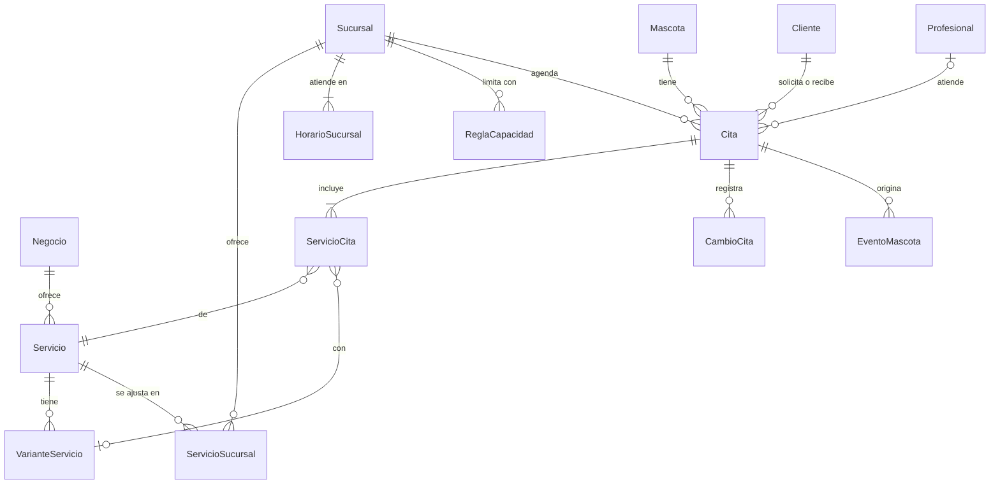

### 8.4 Ciclo de vida de la cita

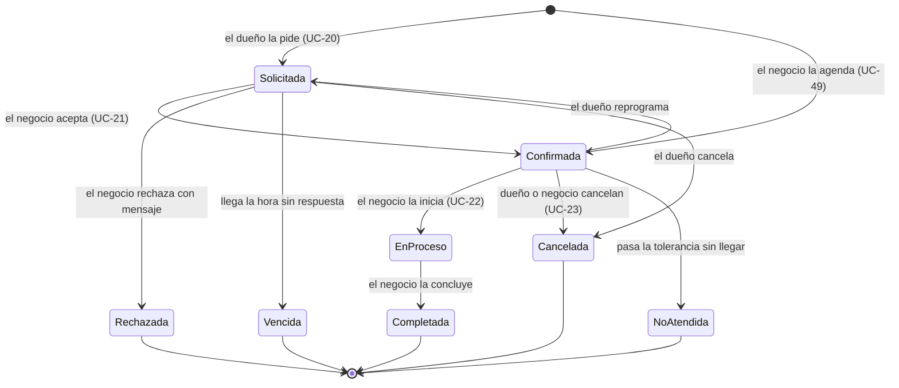

### 8.5 Cómo se calcula la disponibilidad

Para ofrecer horarios al dueño o al personal:

1. Se toma el horario de la sucursal para ese día, incluidos los días especiales.
2. Se calcula la duración de la cita: suma de los servicios y variantes, más sus tiempos adicionales.
3. Para cada horario posible, se cuentan las citas `solicitada`, `confirmada` y `en proceso` que se traslapan en la misma categoría.
4. El horario está disponible si ese número es menor que la capacidad de la regla que aplica.

### 8.6 Decisiones confirmadas

| # | Decisión |
|---|---|
| 1 | La capacidad se define por categoría de servicio. |
| 2 | Sin agenda por profesional en el MVP; el profesional se asigna de forma opcional. |
| 3 | Una cita puede incluir varios servicios para la misma mascota; la duración es la suma. |
| 4 | Una cita solicitada aparta capacidad; sin respuesta antes de la hora, pasa a `vencida`. |
| 5 | Si reprograma el dueño, vuelve a `solicitada`; si reprograma el negocio, queda confirmada. Misma cita, con historial. |
| 6 | La ventana de cancelación de la plataforma es el mínimo; el negocio puede exigir más en servicios concretos. |
| 7 | Anticipación máxima para solicitar: 30 días, configurable. |
| 8 | La cita guarda un precio estimado; el final se registra al concluir o en la venta. |

Surgió un caso de uso que faltaba: **UC-50 — Configurar horario y capacidad de sucursal**, porque ningún caso de uso cubría quién define horarios, días especiales y capacidad.

---

## 9. Bloque 7 — Inventario, promociones y ventas

### 9.1 Qué resuelve

- Qué productos vende o consume cada negocio y cuántos hay en cada sucursal.
- Cómo se mueve el inventario y cuánto vale.
- Cómo se arman las promociones.
- Cómo se cobra en el punto de venta, cómo se cancela una venta y cómo se audita.

La operación de inventario ya está aprobada en `docs/05-inventario.md`; este bloque la traduce a entidades y agrega la venta.

### 9.2 Entidades

| Entidad | Capa | Qué es | Reglas principales |
|---|---|---|---|
| **Producto** | Núcleo | Artículo del catálogo del negocio. | Nombre, imagen, descripción breve, categoría, unidad de medida, código de barras opcional, precio con IVA (dos decimales), tasa de IVA y estado visible u oculto. |
| **CategoriaProducto** | Núcleo | Agrupación de productos del negocio. | Se usa en el POS, en consultas y en conteos cíclicos. |
| **ProductoSucursal** | Núcleo | Un producto en una sucursal. | Existencia, stock mínimo y máximo, costo promedio (cuatro decimales) y, si aplica, precio propio de la sucursal. La existencia solo cambia con movimientos. |
| **MovimientoInventario** | Núcleo | Entrada o salida de un producto en una sucursal. | Tipo (tabla de `05-inventario.md`), cantidad entera, costo unitario, existencia resultante, motivo, usuario, fecha y origen (venta, cancelación, evento clínico, cita, conteo). No se edita ni se borra. |
| **ConteoFisico** | Núcleo | Conteo de toda la sucursal o de una categoría (UC-43). | Estados: `en captura`, `autorizado`. Al autorizar genera los ajustes. |
| **ConteoDetalle** | Núcleo | Por producto: existencia teórica, cantidad contada y diferencia. | |
| **Promocion** | Núcleo | Paquete de productos con precio propio. | Nombre, imagen, precio con IVA, estado y vigencia opcional (desde y hasta). Es del negocio; su disponibilidad en cada sucursal se calcula con la existencia de sus componentes. |
| **ComponentePromocion** | Núcleo | Producto y cantidad que forman la promoción. | Cambiar componentes no altera ventas pasadas. |
| **Venta** | Núcleo | Cobro realizado en el POS de una sucursal. | Folio consecutivo por sucursal, sucursal, usuario, fecha, cliente opcional (vinculado o provisional), cita opcional, total, recibido y cambio. Estados: `registrada`, `cancelada`. Se guarda en una transacción con sus detalles, pagos y movimientos. |
| **TasaIVA** | Núcleo | Catálogo de tasas de IVA (16 %, 8 %, 0 %, etc.). | Lo administra la plataforma; 16 % por defecto. Cada producto y servicio usa una. |
| **VentaDetalle** | Núcleo | Cada renglón de la venta. | Tipo (ver 9.5), referencia, cantidad, precio unitario, importe, tasa de IVA e IVA calculado, tal como se cobraron. En promociones guarda también sus componentes al momento de la venta. |
| **PagoVenta** | Núcleo | Cómo se pagó la venta. | Medio (efectivo, tarjeta con terminal propia, transferencia) e importe. Solo se registra; no se procesa. |
| **CorteCaja** | Núcleo | Resumen del día de una sucursal y de cada usuario (UC-51). | Número de ventas y cancelaciones y total por medio de pago. Se calcula a partir de las ventas; no se edita. |
| **ImpresionTicket** | Núcleo | Cada vez que se genera o imprime el ticket de una venta. | Original, copia o cancelada; quién y cuándo. El PDF se genera al pedirlo. |
| **CancelacionVenta** | Núcleo | La cancelación de una venta (UC-27). | Una sola por venta. Motivo, usuario, fecha y los movimientos de devolución que generó. |

### 9.3 Relaciones

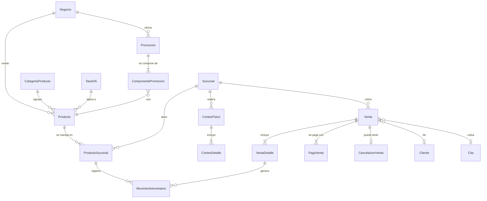

### 9.4 Reglas de la venta

1. El personal arma la venta en el POS; el API vuelve a validar precios, existencias y permisos al confirmar.
2. Si un precio cambió entre que se armó y se confirmó la venta, se rechaza y se muestra el precio nuevo.
3. Cada venta lleva una llave única desde el cliente para que un doble envío no la registre dos veces.
4. Productos y componentes de promociones generan salidas de inventario; si falta existencia, la venta no se registra.
5. La cancelación genera devoluciones exactas de lo que salió y deja de contar para referidos.

### 9.5 Tipos de renglón de una venta

| Tipo | De dónde sale | Mueve inventario |
|---|---|---|
| Producto | Catálogo | Sí, salida del producto |
| Promoción | Catálogo | Sí, salida de cada componente |
| Servicio | Cita que se cobra o catálogo (incluye "Aplicación con producto del dueño") | No; lo aplicado en consulta ya descontó en el expediente |
| Espacio pagado de mascota | UC-37 | No; genera el `CargoEspacioMascota` del bloque 2 |

### 9.6 Decisiones confirmadas

| # | Decisión |
|---|---|
| 1 | El precio lo fija el negocio y cada sucursal puede ajustarlo. |
| 2 | Una venta incluye productos, promociones, servicios y espacios pagados de mascota. |
| 3 | Se registra el medio de pago (efectivo, tarjeta con terminal propia, transferencia) sin procesarlo. |
| 4 | Corte de caja diario por sucursal y por usuario (nuevo UC-51). |
| 5 | Promociones del negocio con vigencia opcional; disponibilidad por componentes. |
| 6 | Sin descuentos manuales en el MVP. |
| 7 | Folio consecutivo por sucursal para el ticket. |

### 9.7 Ticket de venta: decisiones confirmadas

El contenido está en la sección 10.1 del requerimiento.

| # | Decisión |
|---|---|
| 1 | Cada producto y servicio tiene su tasa de IVA, del catálogo de la plataforma (16 % por defecto). El ticket desglosa subtotal, IVA por tasa y total. |
| 2 | Leyenda "Este ticket no es un comprobante fiscal" y pie de página configurable por el negocio. |
| 3 | En el MVP el ticket se genera en PDF y se imprime con cualquier impresora; la térmica directa queda para después. |
| 4 | Reimpresión marcada "Copia" o "Cancelada"; cada impresión queda registrada. |
| 5 | El dueño vinculado ve la venta y su ticket en la app; al provisional se le puede enviar el PDF por correo. |

---

## 10. Bloque 8 — Referidos

### 10.1 Qué resuelve

- Cómo invita un usuario o un negocio y cómo se sabe quién invitó a quién.
- Cómo se sigue el avance de cada referido hasta que cumple la condición.
- Qué beneficio se otorga, a quién y cuándo.

Las reglas de negocio ya están en la sección 11 del requerimiento; este bloque las traduce a entidades. Los beneficios se consumen en otros bloques: el espacio por beneficio en el bloque 3 y el mes gratuito en el bloque 2.

### 10.2 Entidades

| Entidad | Capa | Qué es | Reglas principales |
|---|---|---|---|
| **CodigoInvitacion** | Núcleo | Código personal de invitación de un usuario o de un negocio. Es lo que llevan el enlace y el QR. | Uno por cuenta; no cambia. Distinto de la invitación de activación (bloque 4) y de la de autorización (bloque 3). |
| **ReferidoUsuario** | Vertical | Relación entre el usuario que invitó y el que se registró con su código. | Se crea al activar la cuenta del referido (UC-01). Un usuario tiene a lo más un referidor, que no cambia. Guarda los servicios pagados contados hasta la última evaluación. Estados en 10.4. |
| **SolicitudAfiliacion** | Núcleo | Contacto de un negocio invitado desde la página "Quiero afiliarme" (UC-41). | Datos de contacto y código del negocio que invitó. Estados: `nueva`, `en contacto`, `dada de alta`, `descartada`. La atiende el administrador de plataforma. |
| **ReferidoNegocio** | Núcleo | Relación entre el negocio que invitó y el negocio dado de alta a partir de la solicitud. | Se crea en el alta (UC-03). Guarda cuántos periodos pagados consecutivos lleva el negocio referido. Estados en 10.4. |
| **BeneficioReferido** | Núcleo | Beneficio otorgado por un referido cumplido. | Tipo: `espacio de mascota` (usuario) o `mes gratuito` (negocio). Cada referido otorga a lo más un beneficio. El mes gratuito genera un `MovimientoMesAFavor` (bloque 2); el espacio suma capacidad por beneficio (bloque 3). No se revierte. |

### 10.3 Relaciones

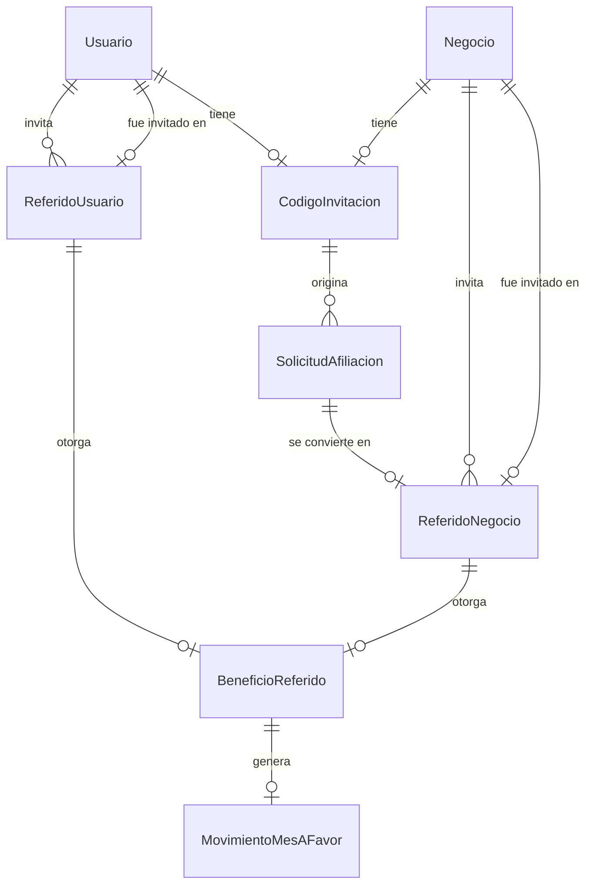

### 10.4 Ciclo de un referido

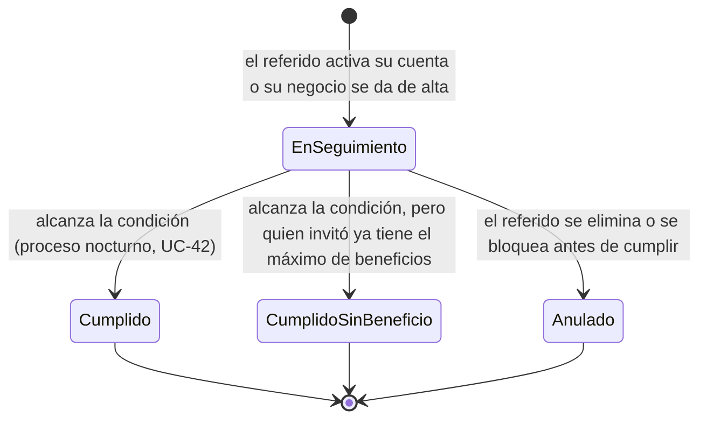

| Condición | Usuario referido | Negocio referido |
|---|---|---|
| Qué cuenta | Citas completadas y ventas asociadas no canceladas, en cualquier negocio, desde la activación de su cuenta. Una venta ligada a una cita cuenta con ella como uno. | Periodos pagados consecutivos en plan Básico o superior. |
| Cuántos | 10 (parámetro) | 2 (parámetro) |
| Beneficio para quien invitó | Un espacio de mascota por beneficio, hasta 5 (parámetro) | Un mes gratuito de su plan, sin límite |

### 10.5 Decisiones confirmadas

| # | Decisión |
|---|---|
| 1 | Un código de invitación permanente por usuario y por negocio. |
| 2 | Quien invita ve nombre y avance de cada referido, sin detalle de servicios ni negocios; el negocio ve los negocios invitados y su estado. |
| 3 | Al llegar al tope, los nuevos referidos quedan como cumplidos sin beneficio. |
| 4 | Al negocio referido solo le cuentan periodos pagados; no la prueba ni los bonificados. |
| 5 | Un beneficio otorgado no se revierte. |
| 6 | El negocio en impago recibe el mes gratuito y lo consume en su siguiente periodo por pagar. |
| 7 | No se usa el propio código; un correo o un RFC ya registrados no pueden ser referidos. |

---

## 11. Bloque 9 — Notificaciones, reseñas, campañas y auditoría

### 11.1 Qué resuelve

- Cómo se avisa a dueños, clientes provisionales y personal: por qué canal, cuándo, y qué pasa si el envío falla.
- Cómo decide cada dueño qué avisos recibe.
- Cómo se piden, moderan y publican las reseñas y las respuestas del negocio.
- Cómo se arma, se dirige y se envía una campaña sin usar datos sensibles.
- Qué queda registrado en la auditoría y quién la consulta.

### 11.2 Entidades

| Entidad | Capa | Qué es | Reglas principales |
|---|---|---|---|
| **TipoNotificacion** | Núcleo | Catálogo de avisos: recordatorio de vacuna, recordatorio de cita, cita confirmada, rechazada, vencida o cancelada, solicitud recibida, beneficio otorgado, invitación de activación, campaña, etc. | Lo administra la plataforma. Define canales permitidos (correo, push, buzón) y cuánto tiempo sigue siendo útil. |
| **PreferenciaNotificacion** | Núcleo | Qué tipos y canales quiere recibir cada usuario. | El dueño puede apagar todo o configurar por tipo y canal. Las campañas son un tipo aparte que se apaga por separado. |
| **DispositivoPush** | Núcleo | Dispositivo registrado para recibir push. | Un usuario puede tener varios; se da de baja al cerrar sesión o si el proveedor lo rechaza. |
| **Notificacion** | Núcleo | Un aviso concreto para un destinatario. | Destinatario (usuario, o correo de un cliente provisional), tipo, canal, contenido, fecha programada y estado: `pendiente`, `enviada`, `fallida`, `descartada`, `leída` (solo en el buzón). No se registra apertura ni entrega. |
| **ErrorEnvio** | Núcleo | Falla al enviar una notificación. | Canal, proveedor, mensaje de error y fecha. |
| **Resena** | Núcleo | Opinión de un dueño sobre una sucursal, solicitada por correo después de un servicio. **R2.** | Calificación, comentario, sucursal y cita de origen. Estados: `recibida`, `en revisión`, `publicada`, `oculta`, `retirada`. La publica el administrador de plataforma. Retención configurable. |
| **RespuestaResena** | Núcleo | Respuesta pública del negocio a una reseña. | Una por reseña; misma moderación; no modifica la reseña. |
| **Campana** | Núcleo | Mensaje promocional o informativo de un negocio. | Alcance (negocio o sucursal), canales (correo, push, banner), contenido, vigencia, frecuencia, prioridad y estado: `borrador`, `activa`, `inactiva`, `oculta` (por la plataforma), `finalizada`. Si es copia, guarda de cuál. |
| **CriterioAudiencia** | Núcleo | Cada filtro de la audiencia de una campaña. | Solo atributos permitidos: especie, raza, sexo, edad, sucursal, servicios previos. |
| **RegistroAuditoria** | Núcleo | Quién hizo qué, cuándo y sobre qué. | Usuario o proceso, acción, entidad afectada, negocio, sucursal, fecha, resumen de antes y después, y origen (app, portal, proceso). Solo se agrega; nunca se edita ni se borra. |

### 11.3 Relaciones

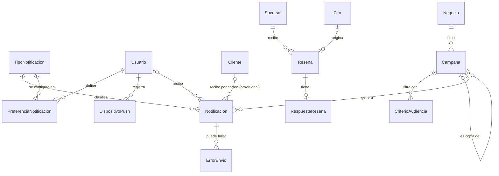

### 11.4 Cómo se envía un aviso

1. Un hecho del sistema (una cita confirmada, una próxima dosis, un beneficio) crea una notificación `pendiente` con su fecha programada.
2. El proceso de envío revisa las preferencias del destinatario y manda por cada canal permitido. El buzón siempre recibe los avisos del dueño.
3. Si el proveedor responde con error, se registra y se reintenta mientras el aviso siga siendo útil.
4. Si se pasa el tiempo útil del tipo (por ejemplo, un recordatorio de cita después de la hora de la cita), la notificación se marca `descartada` y no se envía tarde.

### 11.5 Qué se audita

Las acciones de la sección 13 del requerimiento: vinculaciones, consentimientos, transferencias, autorizaciones, **accesos al expediente clínico**, registros, documentos, datos sensibles, precios, servicios, variantes, suscripciones, inventario, suspensiones, contactos verificados, cancelaciones y citas no atendidas. A eso se suman las acciones de los bloques anteriores: asignación de roles, cambios de políticas y parámetros, activación y fusión de mascotas, correcciones clínicas, cancelaciones de venta, impresiones de ticket, beneficios de referidos, ocultamiento de campañas y moderación de reseñas.

### 11.6 Decisiones confirmadas

| # | Decisión |
|---|---|
| 1 | Reseñas fuera del MVP; entran en R2. El modelo y las reglas quedan listos. |
| 2 | Cada tipo de aviso tiene un tiempo útil; si se pasa, se descarta y se registra. |
| 3 | El personal tiene una bandeja de avisos en `app.amiva.pet` (UC-52). |
| 4 | El dueño apaga correo y push por tipo o todos; el buzón siempre muestra los avisos; las campañas se apagan aparte. |
| 5 | Campañas sin aprobación previa; la plataforma puede ocultarlas. |
| 6 | El banner se muestra en el inicio de la app, por prioridad. |
| 7 | Máximo 2 campañas por semana por dueño, sumando negocios (parámetro). |
| 8 | El negocio consulta su auditoría; la plataforma, toda, solo para soporte y auditado (UC-53). |
| 9 | La retención de la auditoría se define con la revisión legal; mientras tanto no se borra. |
