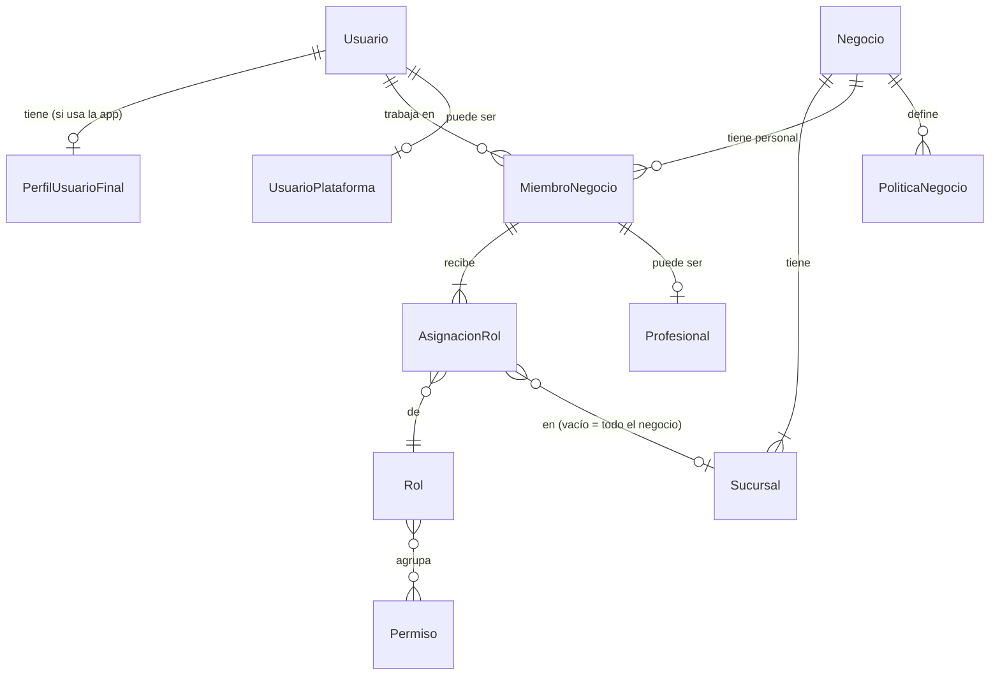

# Modelo conceptual del dominio — amiva.pet

**Versión:** 0.2  
**Fecha:** 2026-09-24  
**Fuente:** `docs/02-requerimiento.md` versión 3.6 y `docs/03-casos-uso-mvp.md` versión 1.5 (aprobados)  
**Estado:** en construcción por bloques. Cada bloque se revisa y aprueba antes de pasar al siguiente.

## 1. Propósito y alcance

Describe **qué cosas existen en el dominio, cómo se relacionan y qué reglas las gobiernan**, sin decidir todavía tablas, columnas, tipos ni índices. Eso corresponde al modelo físico, que se hará después.

Convenciones del documento:

- Los nombres de entidad van en singular y en español (`Negocio`, `Sucursal`).
- Las relaciones se leen en ambos sentidos: "un negocio tiene una o más sucursales; una sucursal pertenece a un solo negocio".
- Cada entidad indica si es del **núcleo genérico** (reutilizable en otros tipos de negocio) o del **vertical de mascotas**.
- Los diagramas usan Mermaid y solo muestran entidades y relaciones.

## 2. Bloques

| # | Bloque | Casos de uso | Capa | Estado |
|---|---|---|---|---|
| 1 | Identidad y acceso | UC-01 a UC-05, UC-44 | Núcleo | **Aprobado** (2026-09-24) |
| 2 | Suscripciones, planes y parámetros | UC-05, UC-29, UC-34 | Núcleo | Pendiente |
| 3 | Mascotas, propiedad y espacios | UC-06, UC-11, UC-12, UC-37, UC-39 | Vertical | Pendiente |
| 4 | Vinculación, privacidad y consentimientos | UC-07 a UC-10, UC-30 | Núcleo + vertical | Pendiente |
| 5 | Expediente, prevención y documentos | UC-13 a UC-17 | Vertical | Pendiente |
| 6 | Servicios, agenda y citas | UC-18 a UC-23 | Núcleo | Pendiente |
| 7 | Inventario, promociones y ventas | UC-24 a UC-28, UC-43 | Núcleo | Pendiente |
| 8 | Referidos | UC-38, UC-40 a UC-42 | Núcleo | Pendiente |
| 9 | Notificaciones, reseñas, campañas y auditoría | UC-31 a UC-33 | Núcleo | Pendiente |

Plan, Suscripción y Entitlement se mencionan en el bloque 1 solo en lo que afecta al acceso; su modelo completo es el bloque 2.

---

## 3. Bloque 1 — Identidad y acceso

### 3.1 Qué resuelve

- Quién es cada persona que entra al sistema y cómo se autentica.
- A qué negocio y a qué sucursales tiene acceso, y con qué permisos.
- Cómo se separan los datos de cada negocio (multi-tenant).
- Cómo se distingue al usuario final, al personal del negocio y al administrador de plataforma.

### 3.2 Separación entre Keycloak y amiva.pet

| Responsabilidad | Dónde vive |
|---|---|
| Autenticación: contraseña, Google, Facebook, Apple, verificación de correo, sesiones y tokens | **Keycloak** |
| Vinculación de cuentas de Google, Facebook y Apple a una misma persona | **Keycloak** |
| Identidad interna de la persona dentro del dominio | **amiva.pet** (`Usuario`, ligado al identificador de Keycloak) |
| Autorización: a qué negocio y sucursal accede y con qué rol y permisos | **amiva.pet** |

**Por qué la autorización no vive en Keycloak:** los permisos de amiva.pet dependen del negocio y de la sucursal (una persona puede ser veterinaria en una sucursal y administradora en otra, o trabajar en dos negocios). Los roles de Keycloak son globales y no modelan bien esa combinación. Keycloak dice **quién eres**; amiva.pet decide **qué puedes hacer y dónde**.

Consecuencia: la entidad `IdentidadExterna` de la sección 18 del requerimiento **no se modela en amiva.pet**. Las cuentas de Google, Facebook y Apple las guarda Keycloak como identidades federadas; amiva.pet solo guarda el identificador de Keycloak del usuario.

### 3.3 Entidades

| Entidad | Capa | Qué es | Reglas principales |
|---|---|---|---|
| **Usuario** | Núcleo | Una persona con cuenta en el sistema. Única en toda la plataforma. | Se liga 1 a 1 con una cuenta de Keycloak. Correo único y verificado. Estados: `pendiente de verificación`, `activo`, `bloqueado`, `eliminado` (lógico). Una misma persona puede ser dueño de mascotas y, además, personal de uno o varios negocios, con la misma cuenta. |
| **PerfilUsuarioFinal** | Vertical | Datos de la persona como dueño o usuario autorizado: nombre visible, teléfono, preferencias de notificación. | Se crea al registrarse en la app móvil (UC-01). Se liga a los espacios de mascotas y al código de invitación. |
| **Negocio** | Núcleo | La empresa cliente de la plataforma, identificada por RFC. **Es el tenant.** | RFC único. Lo da de alta solo el administrador de plataforma (UC-03). Toda la información operativa lleva su identificador (`negocioId`) como llave de aislamiento (RLS). Tiene políticas de negocio (UC-44). |
| **Sucursal** | Núcleo | Ubicación física donde opera el negocio. | Pertenece a un solo negocio. Tiene ubicación geográfica (PostGIS), horarios y estado (`activa`, `inactiva`). Es la unidad de inventario, agenda y ventas. |
| **MiembroNegocio** | Núcleo | La relación de un usuario con un negocio como personal. Equivale a `UsuarioTenant` del requerimiento. | Un usuario puede ser miembro de varios negocios. Estados: `activo`, `desactivado`. Lo crea el administrador de negocio (UC-04) o el de plataforma en el alta (UC-03). Desactivarlo corta el acceso a ese negocio sin afectar su cuenta ni sus otros negocios. |
| **AsignacionRol** | Núcleo | Qué rol tiene un miembro y dónde: en todo el negocio o en una sucursal concreta. | Un miembro puede tener varias asignaciones (por ejemplo, Veterinario en la sucursal Centro y Recepción en la sucursal Norte). Una asignación de alcance negocio aplica a todas sus sucursales. |
| **Rol** | Núcleo | Conjunto de permisos con nombre: Administrador de negocio, Recepción, Veterinario, Estilista. | Catálogo definido por la plataforma en el MVP. |
| **Permiso** | Núcleo | Acción concreta que se puede autorizar, por ejemplo `cita.aceptar`, `venta.cancelar`, `expediente.consultar`. | La matriz rol-permiso es el siguiente paso del plan de trabajo (matriz de roles y permisos). |
| **Profesional** | Núcleo | Datos profesionales de un miembro que presta servicios: especialidad y cédula profesional si aplica. | Solo para miembros que atienden citas o firman registros clínicos. Se usa en agenda y expediente. |
| **UsuarioPlataforma** | Núcleo | Marca a un usuario como administrador de `admin.amiva.pet`. | Separado por completo de los negocios: no es miembro de ningún negocio por serlo. Todas sus acciones se auditan. |
| **PoliticaNegocio** | Núcleo | Configuración que aplica por igual a todas las sucursales de un negocio. | En el MVP: aceptar productos proporcionados por el dueño (activada por defecto). Cambios auditados. |
| **Auditoria** | Núcleo | Registro de quién hizo qué, cuándo, dónde y sobre qué. | Transversal a todos los bloques. En este bloque: altas, bloqueos, asignaciones de rol, cambios de política, inicios de sesión de plataforma. |

### 3.4 Relaciones



Lectura:

- Un **usuario** puede tener perfil de usuario final, ser miembro de cero o más negocios y, aparte, ser administrador de plataforma.
- Un **negocio** tiene una o más sucursales y cero o más miembros.
- Un **miembro** tiene una o más asignaciones de rol; cada una apunta a un rol y, opcionalmente, a una sucursal.
- Un **rol** agrupa muchos permisos y un permiso puede estar en muchos roles.

### 3.5 Cómo se decide el acceso

Para cada petición, el API:

1. Valida el token de Keycloak y obtiene el `Usuario`.
2. Si el usuario opera como personal, toma el **negocio y la sucursal activos** que eligió en `app.amiva.pet` o la tablet.
3. Verifica que sea `MiembroNegocio` activo de ese negocio.
4. Reúne los permisos de sus asignaciones que aplican a esa sucursal (las de la sucursal más las de alcance negocio).
5. Verifica el permiso que exige la operación.
6. Verifica el estado de la suscripción del negocio (bloque 2): en `solo lectura` rechaza escrituras; en `sin acceso` rechaza todo.
7. Fija el negocio en la sesión de base de datos para que RLS filtre los datos.

Para el usuario final, el acceso a una mascota o a un registro depende de la propiedad y la vinculación (bloques 3 y 4), no de roles.

### 3.6 Selección de negocio y sucursal

Una persona que trabaja en más de un negocio, o en varias sucursales, elige al entrar en cuál va a operar. El cambio de negocio o sucursal no requiere cerrar sesión. La sucursal activa determina agenda, inventario y POS.

### 3.7 Ciclos de vida

**Usuario:**

```
pendiente de verificación ──verifica correo──▶ activo ◀──desbloquea── bloqueado
                                                 │  ──bloquea──────────▶
                                                 └──solicita eliminación──▶ eliminado (lógico)
```

**MiembroNegocio:** `activo` ⇄ `desactivado`. No se elimina, para conservar la trazabilidad de lo que registró.

### 3.8 Configuración de Keycloak

| Elemento | Propuesta |
|---|---|
| Realm | `amiva`, uno solo para todas las personas. |
| Clientes | `app-usuario` (app móvil), `app-negocio` (Flutter web y tablet), `admin` (portal de plataforma), `api` (validación de tokens). |
| Proveedores de identidad | Google, Facebook y Apple, habilitados solo para `app-usuario`. |
| Usuario y contraseña | Para `app-negocio` y `admin`. |
| Segundo factor | Obligatorio para `admin`; opcional para administradores de negocio en el MVP. |
| Roles en Keycloak | Ninguno de negocio. Solo se usa para autenticar. |

### 3.9 Decisiones confirmadas

| # | Decisión |
|---|---|
| 1 | Una sola cuenta por persona: la misma cuenta sirve para la app del dueño y para `app.amiva.pet`. |
| 2 | El negocio es el tenant; no hay entidad `Tenant` aparte. |
| 3 | Roles fijos en el MVP (Administrador de negocio, Recepción, Veterinario, Estilista); roles propios del negocio en una versión posterior. |
| 4 | Un rol puede asignarse a una sucursal concreta o a todo el negocio. |
| 5 | El administrador de plataforma no es miembro de ningún negocio ni ve datos operativos, salvo las funciones de soporte que se definan. |
| 6 | Segundo factor obligatorio para administradores de plataforma; opcional para administradores de negocio en el MVP. |
| 7 | Un solo realm de Keycloak (`amiva`) para todos, con segundo factor en el cliente `admin`. |
