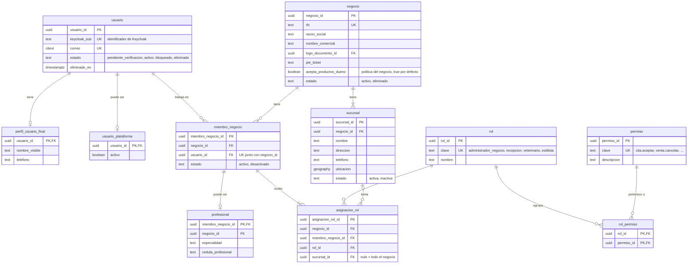
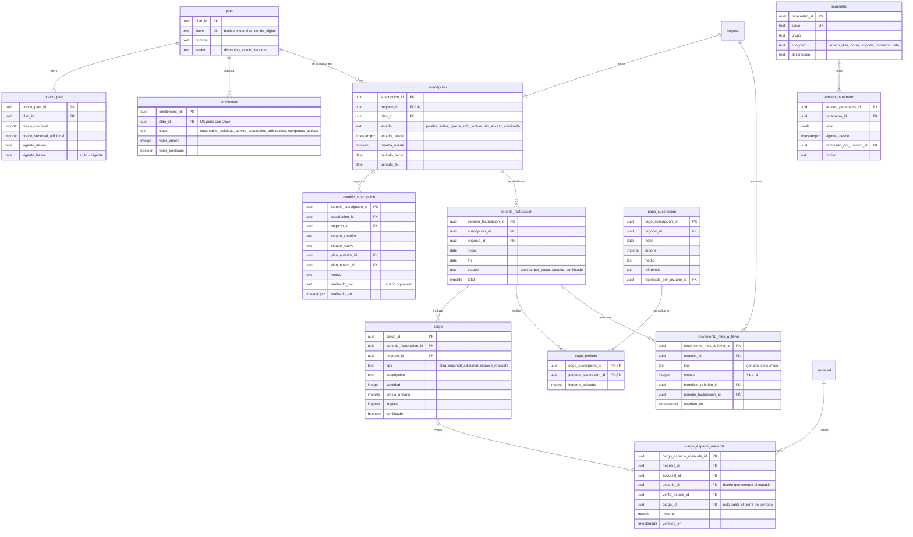
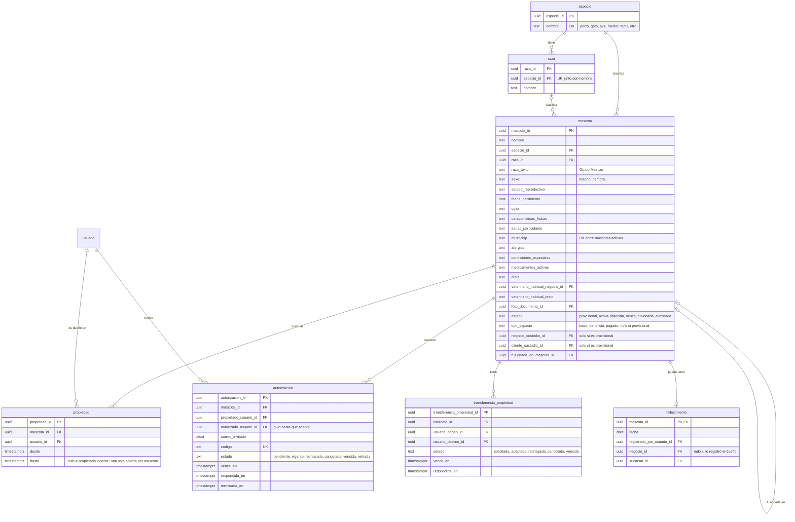
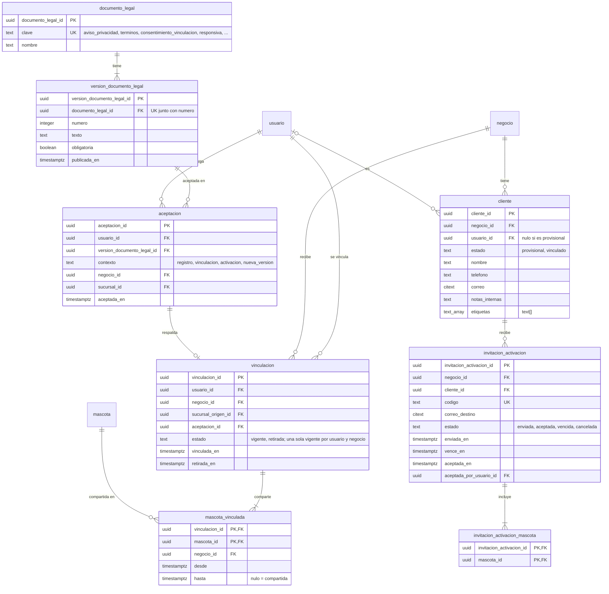
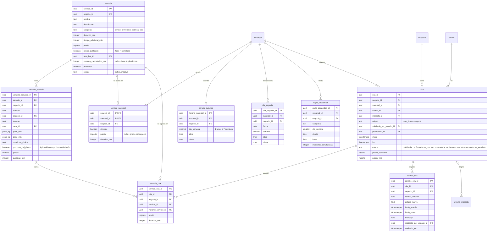
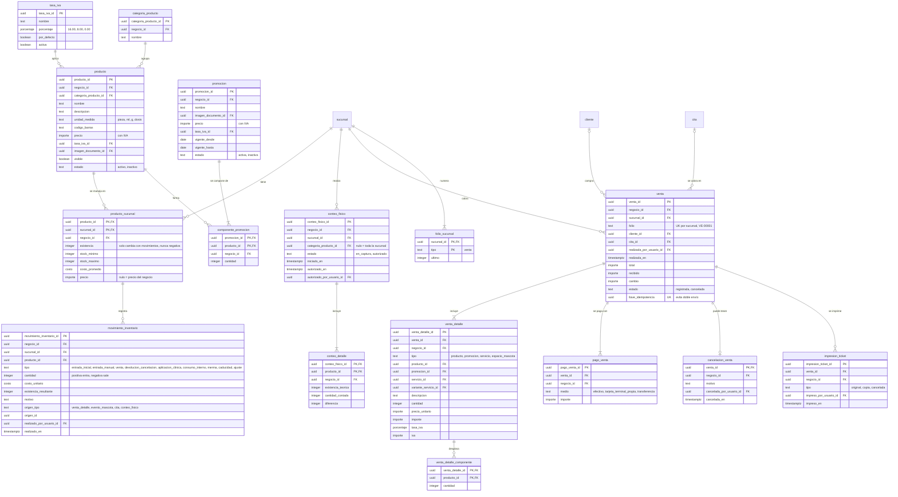
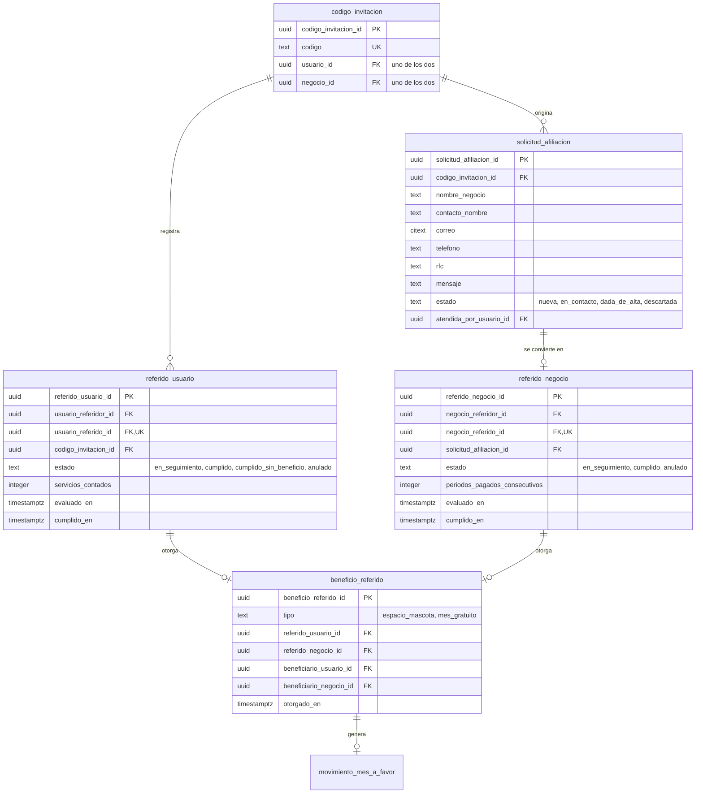
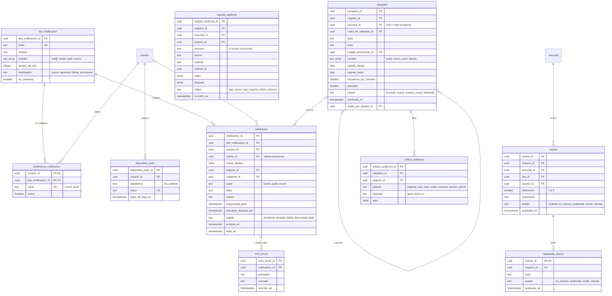

# Modelo de datos — amiva.pet

**Versión:** 1.0  
**Fecha:** 2026-09-24  
**Fuente:** `docs/06-modelo-conceptual.md` versión 1.0 (aprobado)  
**Base de datos:** PostgreSQL 18 + PostGIS 3.6  
**Estado:** aprobado el 2026-09-24. Todavía no es un script de creación; índices, políticas RLS y migraciones se detallan después. Los diagramas se validaron con el analizador oficial de Mermaid.

## 1. Propósito

Traduce el modelo conceptual a **tablas, campos, tipos de datos y relaciones**. Cada sección corresponde a un bloque del modelo conceptual y trae su diagrama entidad-relación.

Los diagramas usan Mermaid. En VS Code se ven con la vista previa de Markdown (`Ctrl+Shift+V`) y la extensión *Markdown Preview Mermaid Support*. Los diagramas grandes se pueden ampliar con el zoom de la vista previa.

## 2. Convenciones

| Tema | Convención |
|---|---|
| Nombres | Tablas y columnas en español, en `snake_case` y con nombre completo: `venta_id`, `producto_id`, nunca `id`. |
| Llave primaria | `<tabla>_id` de tipo `uuid` (versión 7, ordenable por tiempo), generado por el API. |
| Identificador visible | El prefijo (`ven_`, `mas_`, `neg_`...) lo agrega el API al exponer el identificador; no se guarda. El folio de venta es un campo aparte. |
| Aislamiento | Toda tabla con datos de un negocio lleva `negocio_id` y una política RLS que filtra por el negocio de la sesión. |
| Columnas comunes | Toda tabla tiene `creado_en timestamptz` y `actualizado_en timestamptz`; las que registran una acción de una persona tienen además `creado_por_usuario_id uuid`. No se repiten en los diagramas. |
| Estados y tipos | Columnas `text` con restricción `CHECK` de valores permitidos, no tipos `enum` de PostgreSQL, para poder agregar valores sin migraciones complejas. |
| Fechas | `timestamptz` para momentos (se guarda en UTC); `date` para fechas sin hora; `time` para horarios. |
| Borrado | Donde el requerimiento pide borrado lógico, columna `eliminado_en timestamptz`. Las tablas de historial (movimientos, cambios, auditoría) solo aceptan inserciones. |
| Correos | Tipo `citext` (extensión de PostgreSQL) para comparar sin distinguir mayúsculas. |

### 2.1 Dominios

Tipos propios para que el dinero y las medidas se guarden siempre igual:

| Dominio | Tipo base | Uso |
|---|---|---|
| `importe` | `numeric(12,2)` | Precios, totales, pagos, cambio, cargos. |
| `costo` | `numeric(14,4)` | Costo unitario y costo promedio de inventario. |
| `porcentaje` | `numeric(5,2)` | Tasas de IVA. |
| `peso_kg` | `numeric(6,2)` | Peso de la mascota. |

`geography` es `geography(Point, 4326)` de PostGIS (latitud y longitud).

### 2.2 Notación de los diagramas

- `PK` llave primaria, `FK` llave foránea, `UK` valor único.
- `||--o{` uno a muchos, `||--o|` uno a cero o uno, `}o--o{` muchos a muchos.
- Una tabla de otro bloque aparece solo con su nombre, sin campos.

---

## 3. Identidad y acceso (bloque 1)

La política del negocio del bloque 1 (`PoliticaNegocio`) queda como columna de `negocio` (`acepta_productos_dueno`), porque en el MVP es una sola. Si crecen, pasan a su propia tabla.

---

## 4. Suscripciones, planes y parámetros (bloque 2)

---

## 5. Mascotas, propiedad y espacios (bloque 3)

Los **espacios** no tienen tabla: se calculan con el parámetro de espacios base, los beneficios de referidos (`beneficio_referido`) y los espacios pagados (`cargo_espacio_mascota`), contra las mascotas activas por `tipo_espacio`. El **último peso** tampoco: sale del evento de peso más reciente.

---

## 6. Vinculación, privacidad y clientes (bloque 4)

En la tabla, `etiquetas` es de tipo `text[]`; en el diagrama aparece como `text_array` porque Mermaid no acepta corchetes en ese lugar.

---

## 7. Expediente, prevención y documentos (bloque 5)

```mermaid
erDiagram
    evento_mascota {
        uuid evento_mascota_id PK
        uuid mascota_id FK
        uuid negocio_id FK "nulo si lo registró el dueño"
        uuid sucursal_id FK
        uuid registrado_por_usuario_id FK
        uuid profesional_id FK "miembro_negocio"
        uuid cita_id FK
        text tipo "consulta, aplicacion_preventiva, certificado, servicio_no_clinico, nota_interna, evento_dueno"
        text nivel "1, 2, 3, interno"
        timestamptz ocurrido_en
        text estado "vigente, corregido"
        uuid corrige_evento_id FK
        text motivo_correccion
    }
    consulta {
        uuid evento_mascota_id PK, FK
        text motivo
        text diagnostico
        text tratamiento
        text observaciones
    }
    signos_vitales {
        uuid signos_vitales_id PK
        uuid evento_mascota_id FK
        peso_kg peso "nivel 1"
        numeric temperatura_c "numeric(4,1)"
        smallint frecuencia_cardiaca
        smallint frecuencia_respiratoria
        smallint condicion_corporal "escala 1 a 9"
    }
    receta {
        uuid receta_id PK
        uuid evento_mascota_id FK
        text indicaciones
    }
    receta_medicamento {
        uuid receta_medicamento_id PK
        uuid receta_id FK
        text medicamento
        text dosis
        text frecuencia
        text duracion
    }
    estudio {
        uuid estudio_id PK
        uuid evento_mascota_id FK
        text tipo "laboratorio, imagen"
        text descripcion
        text resultado
    }
    procedimiento {
        uuid procedimiento_id PK
        uuid evento_mascota_id FK
        text tipo "procedimiento, cirugia"
        text descripcion
        text observaciones
    }
    aplicacion_preventiva {
        uuid evento_mascota_id PK, FK
        text tipo "vacuna, desparasitacion, preventivo"
        text origen_producto "inventario, dueno"
        uuid producto_id FK "si viene del inventario"
        integer cantidad
        text nombre_comercial
        text laboratorio
        text lote
        date caducidad
        date proxima_dosis
        boolean revision_confirmada "solo producto del dueño"
        uuid responsiva_documento_id FK "obligatoria si es del dueño"
    }
    certificado {
        uuid evento_mascota_id PK, FK
        text tipo "vacunacion, salud, viaje"
        uuid documento_id FK
    }
    servicio_no_clinico {
        uuid evento_mascota_id PK, FK
        timestamptz inicio
        timestamptz conclusion
        text observaciones
    }
    nota_interna {
        uuid evento_mascota_id PK, FK
        text texto
    }
    evento_dueno {
        uuid evento_mascota_id PK, FK
        text tipo "peso, nota"
        peso_kg peso
        text texto
    }
    documento {
        uuid documento_id PK
        uuid negocio_id FK "nulo si lo subió el dueño"
        uuid subido_por_usuario_id FK
        uuid mascota_id FK
        uuid evento_mascota_id FK
        text tipo "fotografia, receta, estudio, firmado, responsiva, logo, producto"
        text nombre_archivo
        text tipo_contenido "image/jpeg, image/png, image/webp, application/pdf"
        bigint tamano_bytes
        text clave_almacenamiento "ruta en Object Storage"
        text clave_miniatura
        integer version
        uuid reemplaza_documento_id FK
        timestamptz eliminado_en
    }

    mascota ||--o{ evento_mascota : "tiene"
    evento_mascota ||--o| consulta : "es"
    evento_mascota ||--o| aplicacion_preventiva : "es"
    evento_mascota ||--o| certificado : "es"
    evento_mascota ||--o| servicio_no_clinico : "es"
    evento_mascota ||--o| nota_interna : "es"
    evento_mascota ||--o| evento_dueno : "es"
    evento_mascota ||--o{ signos_vitales : "incluye"
    evento_mascota ||--o{ receta : "incluye"
    receta ||--|{ receta_medicamento : "indica"
    evento_mascota ||--o{ estudio : "incluye"
    evento_mascota ||--o{ procedimiento : "incluye"
    evento_mascota ||--o{ documento : "adjunta"
    evento_mascota |o--o| evento_mascota : "corrige a"
    documento |o--o| documento : "reemplaza a"
```

`evento_mascota` es la tabla base; cada tipo tiene su tabla de detalle con la misma llave (herencia por tabla).

---

## 8. Servicios, agenda y citas (bloque 6)

La **disponibilidad** no tiene tabla: se calcula con horarios, días especiales, reglas de capacidad y citas que se traslapan.

---

## 9. Inventario, promociones y ventas (bloque 7)

El **corte de caja** no tiene tabla: se calcula con las ventas, pagos y cancelaciones del día.

---

## 10. Referidos (bloque 8)

---

## 11. Notificaciones, reseñas, campañas y auditoría (bloque 9)

`resena` y `respuesta_resena` son de R2; se incluyen para que el modelo quede completo, pero no se crean en el MVP. `registro_auditoria` solo acepta inserciones y conviene particionarla por mes por su volumen.

---

## 12. Resumen

| Bloque | Tablas |
|---|---|
| 1. Identidad y acceso | 11 |
| 2. Suscripciones, planes y parámetros | 13 |
| 3. Mascotas, propiedad y espacios | 7 |
| 4. Vinculación, privacidad y clientes | 8 |
| 5. Expediente, prevención y documentos | 13 |
| 6. Servicios, agenda y citas | 9 |
| 7. Inventario, promociones y ventas | 16 |
| 8. Referidos | 5 |
| 9. Notificaciones, reseñas, campañas y auditoría | 10 (2 de R2) |
| **Total** | **92** |

Se calculan y no tienen tabla: espacios de mascota, último peso, disponibilidad de agenda, corte de caja, línea de tiempo y carnet.

## 13. Decisiones confirmadas

| # | Decisión |
|---|---|
| 1 | Nombres en `snake_case` y con nombre completo (`venta_id`). Sustituye la forma `ventaId` de App-Ventas. |
| 2 | Llave primaria UUID versión 7 generada por el API; el prefijo solo se agrega al exponerla. |
| 3 | Estados y tipos como `text` con `CHECK`, no `enum` de PostgreSQL. |
| 4 | Dominios `importe`, `costo`, `porcentaje` y `peso_kg`. |
| 5 | La existencia se guarda en `producto_sucursal` y se actualiza en la misma transacción que cada movimiento. |
| 6 | La política del negocio es una columna de `negocio` mientras sea una sola. |
| 7 | `registro_auditoria` se particiona por mes. |

## 14. Siguientes pasos

1. Matriz de roles y permisos: llena `permiso` y `rol_permiso`.
2. Modelo de privacidad: políticas RLS por `negocio_id` y reglas de los niveles de visibilidad sobre `evento_mascota`.
3. Script de creación (migraciones), índices y datos iniciales (especies, roles, tasas de IVA, tipos de notificación, parámetros), cuando empiece el repositorio del API.
